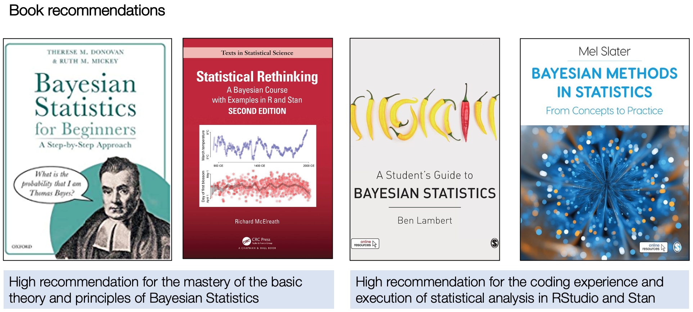

# Reading List {-}

```{r echo=FALSE, out.width = "100%", fig.align='center', cache=TRUE,}

```

## Day 1: Introduction to Probability Distributions {-}

1. **Book**: [Theory] Slater, M. (2022). Bayesian Methods in Statistics: From Concepts to Practice. **Chapters 2: Probability Distributions**. Pages 24-45.

2. **Book**: [Theory] Donovan, T.M., & Mickey, R.M. (2019). Bayesian Statistics for Beginners: A Step-by-Step Approach. **Chapters 3: Probability Functions**. Pages 87-108.

3. **Article**: [Stan Programming] Carpenter, B., Gelman, A., _et al_ (2019). `Stan`: A Probabilistic Programming Language. **J Stat Soft**. DOI: [**10.18637/jss.v076.i01**](https://doi.org/10.18637%2Fjss.v076.i01).

4. **Article**: .

5. **Article**: .

## Day 2: Introduction to Bayesian Inference {-}

TBC

## Day 3: Bayesian Generalised Linear Models (GLMs) {-}

1. **Book**: [Theory] Slater, M. (2022). Bayesian Methods in Statistics: From Concepts to Practice. **Chapters 5: General Models**. Pages 114-151.

2. **Article**: [Theory] Baldwin, S.A., & Larson, M.J. (2017). An introduction to using Bayesian linear regression with clinical data. **Behavior Research and Therapy**. 98:58-75. DOI: [**10.1016/j.brat.2016.12.016**](https://doi.org/10.1016/j.brat.2016.12.016).

2. **Book**: [Theory] Gelman, A _et al_. (2014). Bayesian Data Analysis (3rd Edition).**Chapters 14: Introduction to Regression Models**. Pages 353-378.

## Day 4: Bayesian Hierarchical Regression Models {-}

1. **Article**: [Stan Programming] Sorensen, T., & Vasishth, S. (2016). Bayesian linear mixed models using Stan: A tutorial for psychologists, linguists, and cognitive scientists. **Tutorials in Quantitative Methods for Psychology**. 12(3):175-200. DOI: [**10.20982/tqmp.12.3.p175**](https://www.tqmp.org/RegularArticles/vol12-3/p175/p175.pdf)

2. **Book**: [Theory] Gelman, A _et al_. (2014). Bayesian Data Analysis (3rd Edition).**Chapters 15: Hierarchical Linear Models**. Pages 381-402.

## Day 5: Bayesian Spatial Modelling for Areal Data in Stan {-}

1. **Article**: [Methodology] Li, L. _et al_ (2022). An ecological study exploring the geospatial associations between socioeconomic deprivation and fire-related dwelling casualties in the England (2010–2019). **Applied Geography**. 144(1027718). DOI: [**10.1016/j.apgeog.2022.102718**](https://doi.org/10.1016/j.apgeog.2022.102718).

2. **Article**: [Theory] Morris, M. _et al_ (2019). Bayesian hierarchical spatial models: Implementing the Besag York Mollié model in stan. **Spatial and Spatio-temporal Epidemiology**. 31(100301). DOI: [**10.1016/j.sste.2019.100301 **](https://doi.org/10.1016/j.sste.2019.100301)

3. **Online Tutorials**: [Stan Programming] Morris, M. _et al_ (2019). Spatial Models in Stan: Intrinsic Auto-Regressive Models for Areal Data. URL: https://mc-stan.org/users/documentation/case-studies/icar_stan.html

4. **Article**: [Methodology] Gomez, M.J. _et al_ (2023). Bayesian spatial modeling of childhood overweight and obesity prevalence in Costa Rica. **BMC Public Health**. 23(651). DOI:[**10.1186/s12889-023-15486-1**](https://doi.org/10.1186/s12889-023-15486-1)

5. **Article**: [History] Besag, J. (1974). Spatial interaction and the statistical analysis of lattice systems. **Journal of the Royal Statistical Society**. Series B (Methodological) (1974): 192-236.

6. **Article**: [History] Besag, J. & Kooperberg, K. (1995) “On conditional and intrinsic autoregression. **Biometrika**. 733-746.

7. **Article**: [History] Riebler, A., _et al_ (2016). An intuitive Bayesian spatial model for disease mapping that accounts for scaling. **Statistical methods in medical research**. 25(4): 1145-1165. DOI: [**10.1177/0962280216660421**](https://doi.org/10.1177/0962280216660421)