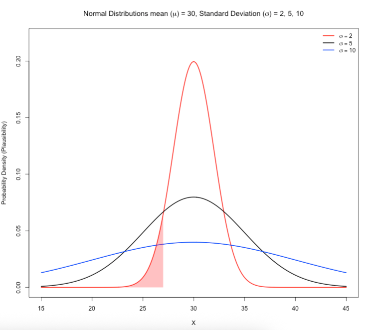
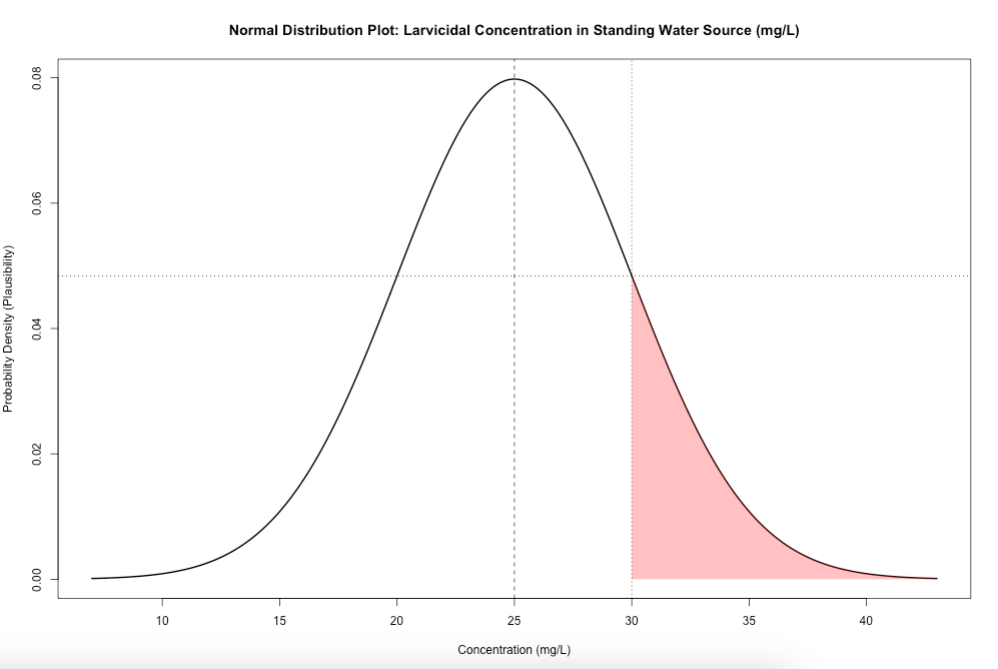
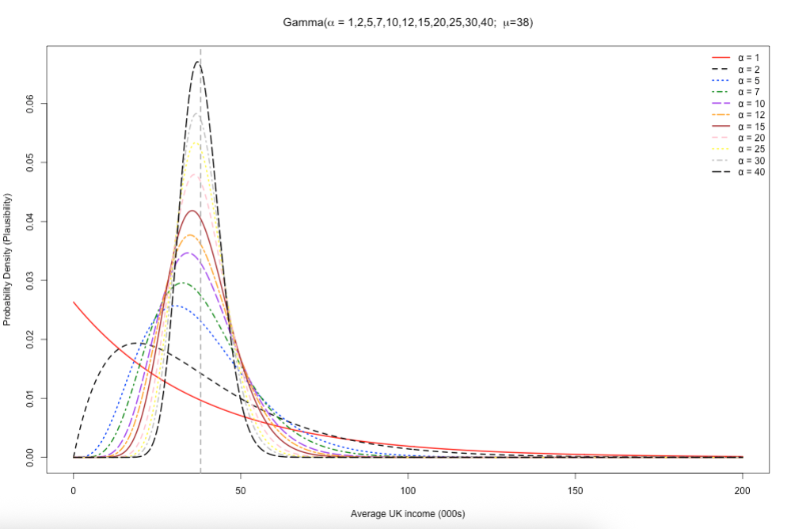
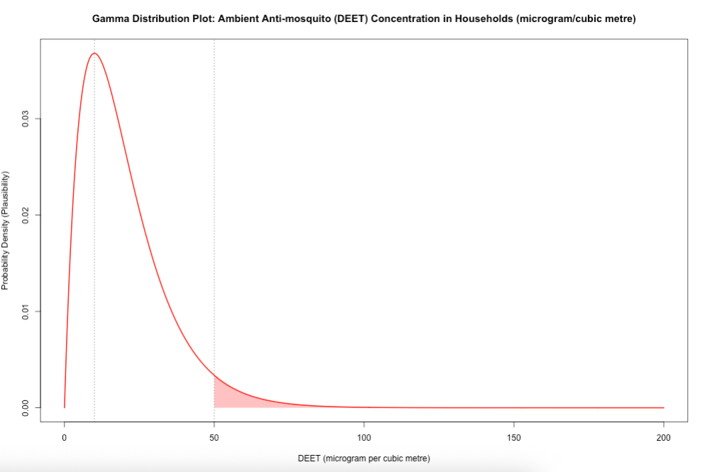
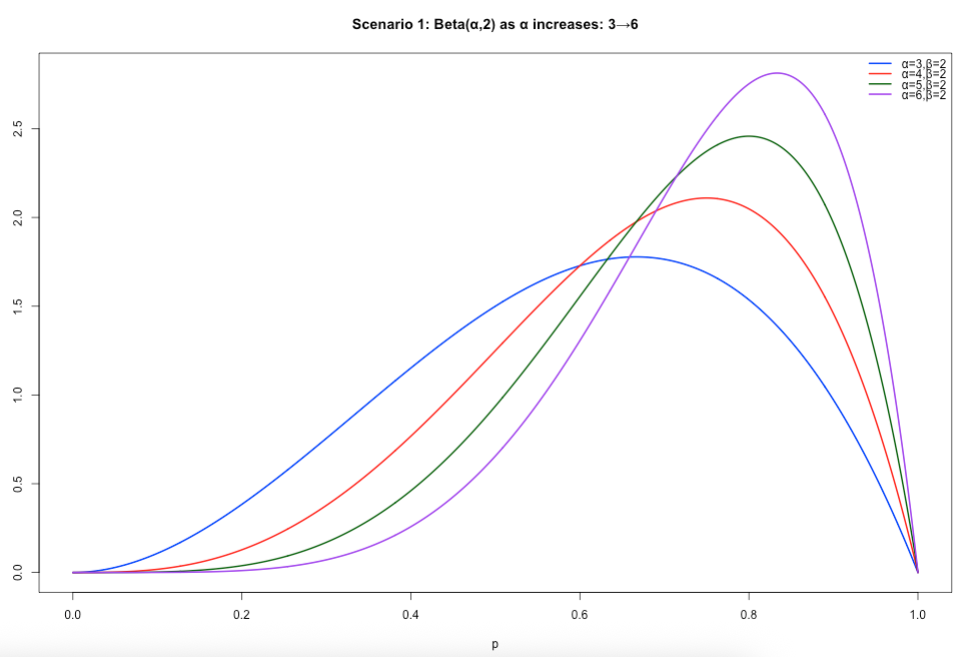
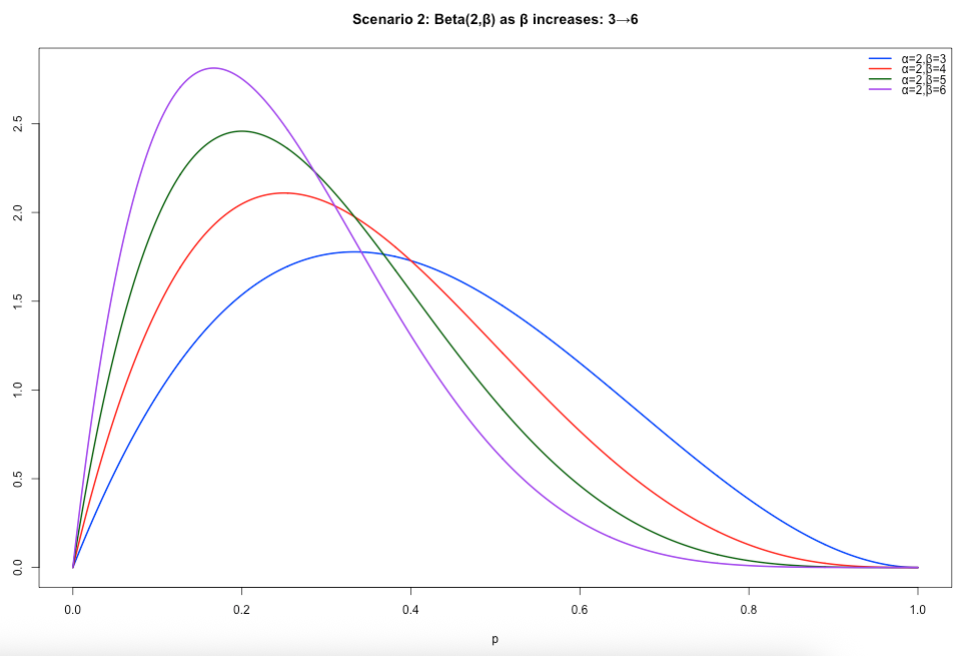
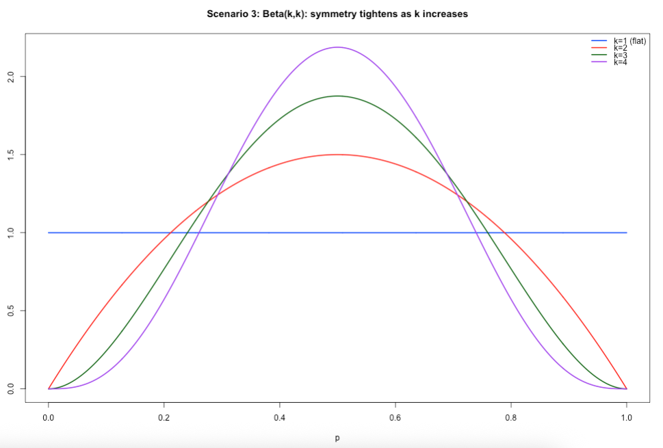
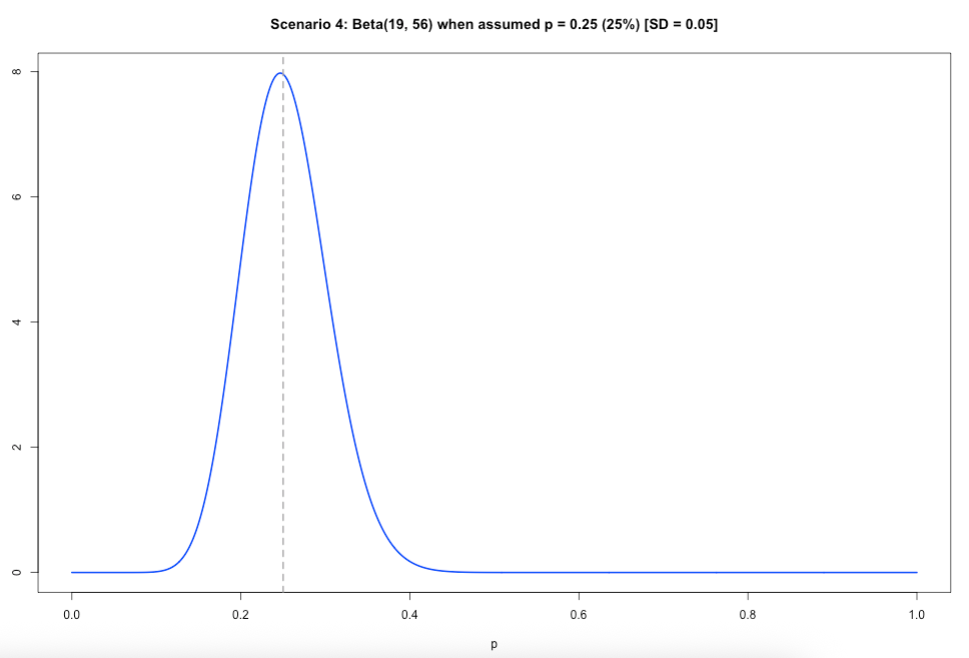
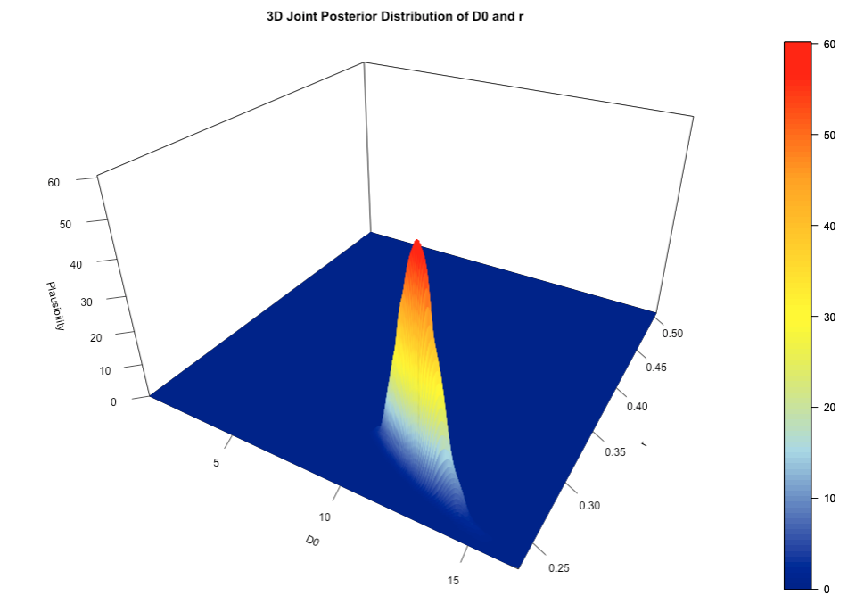
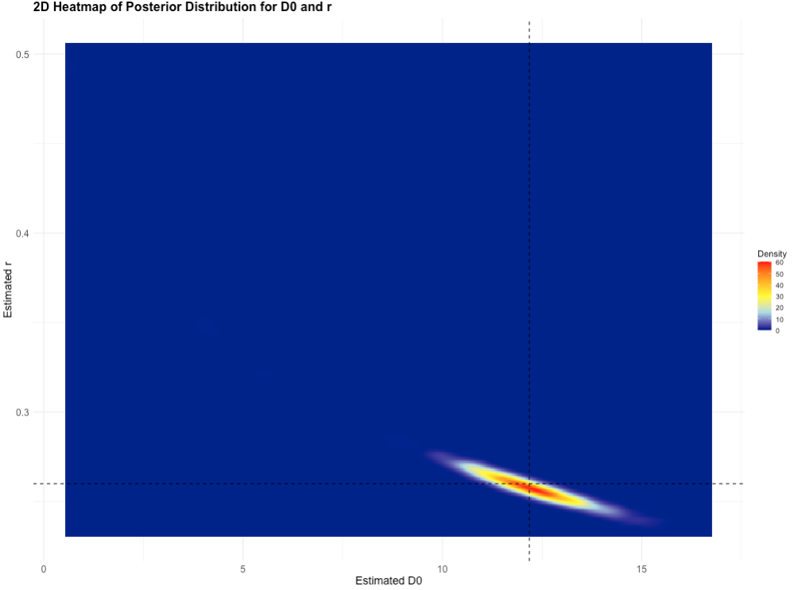

# Appendix

## How to generate a Probability Distribution

This section includes the r-syntax codes for generating the plots shown in Day 1's lectures on **Introduction to Probability Distributions**

### Figure Image on Slide 33

Here, we wanted to understand the behaviour of the **Normal** distribution with an assumed fixed value for the mean ($\mu$) and changing values for the standard deviation ($\sigma$) to illustrate how the spread are affected by changing the $\sigma$.

See code:

```{r, eval=FALSE}
# let us define our parameters (mu = 30, sds = 2, 5 or 10)
# make x range from 15 to 45 spread over tiny intervals
mean <- 30
sds <- c(2, 5, 10)
colors <- c("red", "black", "blue")
x <- seq(15, 45, length.out = 500)

# plot the first distribution (σ = 2)
y1 <- dnorm(x, mean = mean, sd = sds[1])
plot(x, y1, type = "l", col = colors[1], lwd = 2,
	ylim = c(0, 0.22), xlab = "X", ylab = "Probability Density (Plausibility)",
	main = expression(paste("Normal Distributions mean (", mu, ") = 30, Standard Deviation (", sigma, ") = 2, 5, 10")))

# add the other curves for when sds = 5 or 10
lines(x, dnorm(x, mean = mean, sd = sds[2]), col = colors[2], lwd = 2)
lines(x, dnorm(x, mean = mean, sd = sds[3]), col = colors[3], lwd = 2)

# next code adds the shaded area to calculate the cumulative probability (area under the curve)
# add shaded area under the red curve (σ = 2) between x = 15 and x = 27
x_shade <- seq(15, 27, length.out = 100)
y_shade <- dnorm(x_shade, mean = mean, sd = sds[1])
polygon(c(x_shade, rev(x_shade)),
	c(rep(0, length(x_shade)), rev(y_shade)),
	col = rgb(1, 0, 0, 0.3), border = NA)

# Add legend
legend("topright", legend = c(expression(sigma == 2), expression(sigma == 5), expression(sigma == 10)),
	col = colors, lty = 1, lwd = 2, bty = "n")
```

See output and refer to the description on slide 33:

```{r echo=FALSE, out.width = "100%", fig.align='center', cache=TRUE,}
 
```

### Figure Image on Slide 34

Here, we illustrated an example of using a **Normal** distribution with environmental concentrations of BTI larvicide dunks in standing water bodies where we assumed $\mu_{BTI}$ = 25.0mg/L and $\sigma_{BTI}$ = 5.0mg/L. The range of values start from 7.0 mg/L to 43.0 mg/L, and **30mg/L is used as a cutoff in this example**.

You can directly estimate the **plausibility** of a given value by using the `dnorm()` function. The likelihood of BTI concentrations in the environment being 30mg/L relative to all other BTI values in the distribution.

See code:

```{r, eval=FALSE}
# compute the plausibility for 30 mg/L when mu = 25 and sd = 5
dnorm(30.0, mean = 25, sd = 5)
# result is 0.0483
```

You can generate curved figure based on the above information. See code:

```{r, eval=FALSE}
# let us define our parameters (mu = 25 and sd = 5)
mu  <- 25
sd  <- 5
# make x range from 7 to 45 spread over increments of 0.1
x   <- seq(7, 43, by = 0.1)
y   <- dnorm(x, mean = mu, sd = sd)

# generate plot
plot(x, y, type = "l", lwd = 2,
	main = "Normal Distribution Plot: Larvicidal Concentration in Standing Water Source (mg/L)",
	xlab = "Concentration (mg/L)",
	ylab = "Probability Density (Plausibility)")

# add vertical line at the mean
abline(v = mu, lty = 2)

# add the shaded area for BTI >= 30
x_shade <- x[x >= 30]
y_shade <- y[x >= 30]
polygon(c(x_shade, rev(x_shade)),
	c(y_shade, rep(0, length(y_shade))),
	col = rgb(1, 0, 0, alpha = 0.3), border = NA)

# add dashed lines to plot
# add the dashed vertical line at the cutoff at 30 
abline(v = 30, lty = 3)
# dashed horizontal line to trace what 30 is in terms of plausibility
abline(h=0.04839414, lty = 3)
```

See output and refer to the description and interpretation on slide 35:

```{r echo=FALSE, out.width = "100%", fig.align='center', cache=TRUE,}
 
```

Note that you can directly estimate the probability of a given value by using the `pnorm()` function. 

The **cumulative probability** of BTI concentrations in the environment being **at most** 30mg/L (area under the curve that is **white**) is 84.1%. 

See code:

```{r, eval=FALSE}
# compute the cumulative probability for 30 mg/L when its assumed mu is 25 and sd is 5
pnorm(30.0, mean = 25, sd = 5)
# result is 0.8413447
```

The **exceedance probability** of BTI concentrations in the environment being **at least** 30mg/L (area under the curve that is **red**) is 15.9%.

See code:

```{r, eval=FALSE}
# compute the exceedance probability for 30 mg/L when its assumed mu is 25 and sd is 5
1 - pnorm(30.0, mean = 25, sd = 5)
# result is 0.1586553
```

### Figure Image on Slide 35

Here, we wanted to understand the behaviour of the **Gamma** distribution for with an assumed fixed mean ($\mu$) and scale ($\beta$) value but with changing values for its shape parameter (i.e., $\alpha$) to illustrate how it effect it **skewed** shape.

See code:

```{r, eval=FALSE}
# define following set of values
mean_val <- 38
shapes   <- c(1, 2, 5, 7, 10, 12, 15, 20, 25, 30, 40)
scales   <- mean_val / shapes

# x-axis for income from 0 to 200k
x <- seq(0, 200, length.out = 500)

# creCompute densities (one column per α)
dens_mat <- sapply(seq_along(shapes), function(i) {
	dgamma(x, shape = shapes[i], scale = scales[i])
})

# Set up empty plot with y-limits
ymax <- max(dens_mat, na.rm = TRUE)
plot(
	x, dens_mat[,1], type = "n",
	ylim = c(0, ymax),
	main = expression(paste("Gamma(", alpha, " = 1,2,5,7,10,12,15,20,25,30,40;  ", mu, "=38)")),
	xlab = "Average UK income (000s)", ylab = "Probability Density (Plausibility)"
)

# Colours & line‐types (one for each α)
cols <- c("red", "black", "blue", "green4", "purple", "orange", "brown", "pink", "yellow", "grey", "black")
ltys <- 1:length(shapes)

# Overlay each curve
for(i in seq_along(shapes)) {
	lines(
		x, dens_mat[,i],
		col = cols[i], lty = ltys[i], lwd = 2
	)
}

# Add vertical dashed line at the mean
abline(v = mean_val, lty = 2, col = "darkgray", lwd = 2)

# Legend
legend(
	"topright",
	legend = paste0("α = ", shapes),
	col    = cols,
	lty    = ltys,
	lwd    = 2,
	bty    = "n"
)

```

See output and refer to the description on slide 35:

```{r echo=FALSE, out.width = "100%", fig.align='center', cache=TRUE,}
 
```

Note the following points:

1. You can directly estimate the **plausibility** of a given value from a Gamma distribution by using the `dgamma()` function.
2. You can directly estimate the **cumulative or exceedance probability** of a given value from a Gamma distribution by using the `pgamma()` function.

### Figure Image on Slide 36

Here, we illustrated an example of using a **Gamma** distribution with environmental chemical concentrations of mosquito repellent (DEET) in households where we assumed $\mu_{DEET}$ = 20.0$\mu g/m^3$, $\alpha$ (shape) = 2 and $\beta$ (scale) = 10. The range of values start from 0.0$\mu g/m^3$ to 200.0$\mu g/m^3$, and **50.0$\mu g/m^3$ is used as a cutoff in this example**.

You can directly estimate the **plausibility** of a given value by using the `dgamma()` function. The likelihood of DEET concentrations in the environment being 50.0$\mu g/m^3$ relative to all other DEET values in the distribution.

See code:

```{r, eval=FALSE}
# compute the plausibility
dgamma(50, shape = 2, scale = 20/2)
# result is 0.003368973
```

You can generate curved figure based on the above information. See code:

```{r, eval=FALSE}
# Set up for the DEET values
x <- seq(0, 200, length.out = 1000)
# mean
mu = 20
# shape parameter < scale → skewed right
shape <- 2
# scale parameter
scale <- mu/shape                           

# Gamma PDF
y <- dgamma(x, shape = shape, scale = scale)
# estimate its median (50th percentile)
med_estimate <- qgamma(0.5, shape = shape, scale = scale)

# Plot
plot(x, y, type = "l", lwd = 2, col = "red",
	main = "Gamma Distribution Plot: Ambient Anti-mosquito (DEET) Concentration in Households (microgram/cubic metre)",
	ylab = "Probability Density (Plausibility)", xlab = "DEET (microgram per cubic metre)")

# shade area for DEET >= 50
x_shade <- x[x >= 50]
y_shade <- y[x >= 50]
polygon(c(x_shade, rev(x_shade)),
	c(y_shade, rep(0, length(y_shade))),
	col = rgb(1, 0, 0, alpha = 0.3), border = NA)
# dashed line at the cutoff
abline(v = 50, lty = 3)
# dashed line at the cutoff
abline(v = (2-1)*scale, lty = 3)            
```

See output and refer to the description and interpretation on slide 36:

```{r echo=FALSE, out.width = "100%", fig.align='center', cache=TRUE,}
 
```

Note that you can directly estimate the probability of a given value by using the `pgamma()` function. 

The **cumulative probability** of DEET concentrations being **at most** 50.0$\mu g/m^3$ (area under the curve that is **white**) is 95.96%. 

See code:

```{r, eval=FALSE}
# compute the cumulative probability
pgamma(50, shape = shape, scale = scale)
# result is 0.9596
```

The **exceedance probability** of DEET concentrations being being **at least** 50.0$\mu g/m^3$ (area under the curve that is **red**) is 4.04%.

See code:

```{r, eval=FALSE}
# compute the exceedance probability
1 - pgamma(50, shape = shape, scale = scale)
# result is 0.0404
```

### Figure Image on Slide 37-40

Here, we wanted to understand the behaviour of the **Beta** distribution for proportions, and how to centre it accordingly to a given value (i.e., a proportion) using the two shape parameters - ($\alpha$) and ($\beta$). We show codes for four different scenarios.

**Scenario 1:** Specifying both 𝛼 and 𝛽. When 𝛼 is greater than 𝛽, the resulting distribution is that of a **negatively skewed distribution**. Use this scenario if you assume higher proportion values closer to 1 (i.e., 100%) to be more plausible – then let 𝛼 be greater than 𝛽.

See code:

```{r, eval=FALSE}
# Scenario 1: alpha > beta, beta = 2
x  <- seq(0, 1, length.out = 1000)
y1 <- dbeta(x, shape1 = 3, shape2 = 2)
y2 <- dbeta(x, shape1 = 4, shape2 = 2)
y3 <- dbeta(x, shape1 = 5, shape2 = 2)
y4 <- dbeta(x, shape1 = 6, shape2 = 2)
# set y–limits to accommodate the tallest curve
ylim <- c(0, max(y1, y2, y3, y4))

plot(x, y1, type = "l", lwd = 2, col = "blue", ylim = ylim,
	xlab = "p", ylab = "Density",
	main = "Scenario 1: Beta(α,2) as α increases: 3→6")
lines(x, y2, lwd = 2, col = "red")
lines(x, y3, lwd = 2, col = "darkgreen")
lines(x, y4, lwd = 2, col = "purple")
legend("topright",
	legend = c("α=3,β=2","α=4,β=2","α=5,β=2","α=6,β=2"),
	col    = c("blue","red","darkgreen","purple"),
	lwd    = 2,
	bty    = "n")
```

Output of slide 37:

```{r echo=FALSE, out.width = "100%", fig.align='center', cache=TRUE,}
 
```

**Scenario 2:** Specifying both 𝛼 and 𝛽. When 𝛽 is greater than 𝛼, the resulting distribution is that of a positively skewed distribution. If you assume lower proportion values closer to 0 (i.e., 0%) to be more plausible – then let 𝛽 be greater than 𝛼.

See code:

```{r, eval=FALSE}
# Scenario 2: beta > alpha, alpha = 2
x  <- seq(0, 1, length.out = 1000)
y1 <- dbeta(x, shape1 = 2, shape2 = 3)
y2 <- dbeta(x, shape1 = 2, shape2 = 4)
y3 <- dbeta(x, shape1 = 2, shape2 = 5)
y4 <- dbeta(x, shape1 = 2, shape2 = 6)
ylim <- c(0, max(y1, y2, y3, y4))

plot(x, y1, type = "l", lwd = 2, col = "blue", ylim = ylim,
	xlab = "p", ylab = "Density",
	main = "Scenario 2: Beta(2,β) as β increases: 3→6")
lines(x, y2, lwd = 2, col = "red")
lines(x, y3, lwd = 2, col = "darkgreen")
lines(x, y4, lwd = 2, col = "purple")
legend("topright",
	legend = c("α=2,β=3","α=2,β=4","α=2,β=5","α=2,β=6"),
	col    = c("blue","red","darkgreen","purple"),
	lwd    = 2,
	bty    = "n")
```

Output of slide 38:

```{r echo=FALSE, out.width = "100%", fig.align='center', cache=TRUE,}
 
```

**Scenario 3:** Specifying both 𝛼 and 𝛽. When 𝛼 is equal to 𝛽, and increasing both at the same time, **the resulting distribution starts of as a uniform distribution and then converges to that which is akin to a normal distribution**. Uniform – every value for the proportion is equally plausible, while as both parameters increase in the same way, we assume that the proportion of 50% became more and more plausible.

See code:

```{r, eval=FALSE}
# Scenario 3: alpha = beta
x  <- seq(0, 1, length.out = 1000)
y1 <- dbeta(x, shape1 = 1, shape2 = 1)
y2 <- dbeta(x, shape1 = 2, shape2 = 2)
y3 <- dbeta(x, shape1 = 3, shape2 = 3)
y4 <- dbeta(x, shape1 = 4, shape2 = 4)
ylim <- c(0, max(y1, y2, y3, y4))

plot(x, y1, type = "l", lwd = 2, col = "blue", ylim = ylim,
	xlab = "p", ylab = "Density",
	main = "Scenario 3: Beta(k,k): symmetry tightens as k increases")
lines(x, y2, lwd = 2, col = "red")
lines(x, y3, lwd = 2, col = "darkgreen")
lines(x, y4, lwd = 2, col = "purple")
legend("topright",
	legend = c("k=1 (flat)","k=2","k=3","k=4"),
	col    = c("blue","red","darkgreen","purple"),
	lwd    = 2,
	bty    = "n")
```

Output of slide 39:

```{r echo=FALSE, out.width = "100%", fig.align='center', cache=TRUE,}
 
```

**Scenario 4:** When you have a specific value for the proportion which you want the Beta distribution to be centred on – you will have to solve for both 𝛼 and 𝛽! Meaning that you will need to specify an assumed mean value (𝜇) for the proportion and a small value for the standard deviation (𝜎).

- $\beta$ = $\mu$ - 1 + [($\mu$ x (1 - (1-$\mu)^2$ )/$\sigma^2$]

- $\alpha$ = $\beta$$\mu$/(1 - $\mu$)


See code:

```{r, eval=FALSE}
# scenario 4
mu = 0.25
sigma = 0.05

beta = (mu - 1) + (mu *(1-mu)^2)/(sigma^2)
alpha = (beta * mu)/(1-mu)

alpha
beta

# 19
# 56

x  <- seq(0, 1, length.out = 1000)
y <- dbeta(x, shape1 = 19, shape2 = 56)

plot(x, y, type = "l", lwd = 2, col = "blue",
	xlab = "p", ylab = "Density",
	main = "Scenario 4: Beta(19, 56) when assumed p = 0.25 (25%) [SD = 0.05]")

abline(v = mu, lty = 2, col = "darkgray", lwd = 2)
```

Output of slide 40:

```{r echo=FALSE, out.width = "100%", fig.align='center', cache=TRUE,}
 
```

Note the following points:

1. You can directly estimate the **plausibility** of a given value from a **Beta** distribution by using the `dbeta()` function.
2. You can directly estimate the **cumulative or exceedance probability** of a given value from a **Beta** distribution by using the `pbeta()` function.

## How to generate Joint Posterior plot

This section includes the r-syntax codes for generating the plots shown in Day 2’s lectures on **Introduction to Bayesian Inference**

### Joint Posterior Distribution for D0 and r in 3D

Let us revisit the Day 2's practical and re-run the codes and Stan script:

```{r, eval=FALSE}
# Load the packages with library()
library('rstan')
library('tidybayes')
library('posterior')
library('MASS')
library('plot3D')
library('ggplot2')

options(mc.cores = parallel::detectCores())
rstan_options(auto_write = TRUE)

# Simulated data
day <- 0:14
observed_cases <- c(12, 9, 19, 30, 27, 45, 67, 71, 103, 119, 161, 213, 288, 340, 431)

# Data list for Stan
stan_dataset <- list(
	N = length(day),
	t = as.vector(day),
	y = as.integer(observed_cases)
)

# here, using two chains only and setting warming to 20 to obtain a near full posterior distribution
# here, 5000 iterations is being used, and only 40 samples are discarded
fit <- stan(
	file = "Incidence_rates.stan",
	data = stan_dataset,
	iter = 5000,
	warmup = 20,
	chains = 2,
	seed = 20231221,
	verbose = FALSE
)

print(fit, pars = c("D0", "r"), probs = c(0.025, 0.5, 0.975))
```

This is the code for visualising the two parameters' (i.e., `D0' and 'r`) joint posterior distribution in a 3-dimension space.

```{r, eval=FALSE}

# extract (near) full posterior from Stan which include warm up/burnin samples (i.e., non-discarded samples as well)
full_posterior <- spread_draws(fit, D0, r)

# Create a grid of values for the 3D plot
D0_seq <- seq(min(full_posterior$D0), max(full_posterior$D0), length.out = 500)
r_seq <- seq(min(full_posterior$r), max(full_posterior$r), length.out = 500)
grid <- expand.grid(D0 = D0_seq, R = r_seq)

# Estimate the density on the grid
density_vals <- kde2d(full_posterior$D0, full_posterior$r, n = 500)

# 3D surface plot using persp3D
persp3D(
	x = density_vals$x, y = density_vals$y, z = density_vals$z,
	theta = 30, phi = 30,          # Adjust the view angles
	expand = 0.6,                  # Scale the plot
	colvar = density_vals$z,       # Use density values for color mapping
	col = colorRampPalette(c("darkblue", "lightblue", "yellow", "orange", "red"))(100),  # Gradient colors
	xlab = "Estimated D0",                   # X-axis label
	ylab = "Estimated r",                    # Y-axis label
	zlab = "Plausibility (for both)",        # Z-axis label (Density)
	main = "3D Joint Posterior Distribution of D0 and r",
	ticktype = "detailed",         # Detailed tick marks on axes
	facets = TRUE                  # Add grid lines on the surface
)
```

Output for joint posterior distribution (3D-plot):

```{r echo=FALSE, out.width = "100%", fig.align='center', cache=TRUE,}
 
```

### Joint Posterior Distribution for D0 and r in 2D

The joint posterior distribution can be visualised in a 2D (or bird's eye-view) plot:

```{r, eval=FALSE}
# Create a 2D heatmap using ggplot2
heatmap_data <- expand.grid(D0 = density_vals$x, r = density_vals$y)
heatmap_data$Density <- as.vector(density_vals$z)

# Create the heatmap plot using ggplot2
ggplot(heatmap_data, aes(x = D0, y = r, fill = Density)) +
	geom_tile() +
	scale_fill_gradientn(colors = c("darkblue", "lightblue", "yellow", "orange", "red")) +
	geom_vline(xintercept = 12.18, linetype = "dashed", color = "black", size = 1, linewidth = 0.5) +
	geom_hline(yintercept = 0.26, linetype = "dashed", color = "black", size = 1, linewidth = 0.5) +
	labs(
		title = "2D Heatmap of Posterior Distribution for D0 and r",
		x = "Estimated D0", y = "Estimated r", fill = "Density"
	) +
	theme_minimal() +
	theme(
		axis.text = element_text(size = 12), 
		axis.title = element_text(size = 14),
		plot.title = element_text(size = 16, face = "bold")
)
```

Output for joint posterior distribution (2D-plot):

```{r echo=FALSE, out.width = "100%", fig.align='center', cache=TRUE,}
 
```