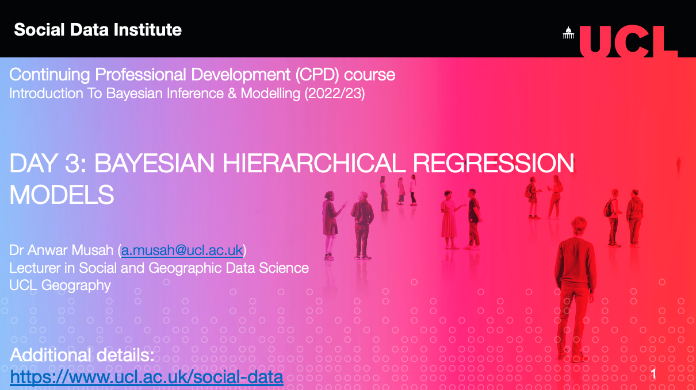

# Bayesian Hierarchical Regression Models

## Introduction

### Lecture video

```{r echo=FALSE, out.width = "100%", fig.align='center', cache=TRUE,}
 
```
**Parts:** [**[1]**](https://youtu.be/hP86-T_k38k) | [**[2]**](https://youtu.be/r1RPPAtFV0w)


###  Live walk-through demonstration video

```{r, warnings=FALSE, message=FALSE, echo=FALSE}
library(vembedr)
embed_youtube('DFi_ao4TbAQ', height=400) %>% use_align('center')
```
[[**Watch on YouTube**]](https://youtu.be/DFi_ao4TbAQ)


We will learn how to perform hierarchical regression modelling within a Bayesian framework. These models are useful and robust especially if there's a hierarchical structure in the dataset. This artefact must be taken into account to ensure statistical robustness. We will focus on implementing 2-level hierarchical regressions with examples on **random-intercept-only** and **slope** model as these are quite simple to pull off in Stan. 

Let us begin.

### Datasets & setting up the work directory 

Go to your folder **CPD-course** and create a sub folder called "**Day 3**". Here, we will store all our R & Stan scripts and data files. Set your work directory to the **Day 3** folder.

For Windows, the code for setting the work directory will be:

```{r, eval = FALSE}
setwd("C:/Users/AccountName/Desktop/CPD-course/Day 3")
```

For MAC, the code for setting the work directory will be:

```{r, eval = FALSE}
setwd("/Users/AccountName/Desktop/CPD-course/Day 3")
```

The dataset for this practical are:

- `Maths attainment and activity study.csv`
- `Pregnancies and hospital data.csv`

We will start of with the `Maths attainment and activity study.csv`. Let us load this dataset into memory:

```{r, eval=FALSE}
# load up the data
Maths_dataset <- read.csv("Maths attainment and activity study.csv")
```

### Loading packages

We need to load the installed packages including `rstan` and `tidybayes`:

```{r, eval = FALSE}
# load up packages
library('rstan')
library('tidybayes')
library('tidyverse')
```

As usual, for the best experience, configure Stan:

```{r, eval = FALSE}
# configure Stan
options(mc.cores = parallel::detectCores())
rstan_options(auto_write = TRUE)
```

## Data preparation and set-up for Bayesian analysis in Stan

We are going to fit a 2-level hierarchical model on a continuous outcome i.e., `MathScore` and see how the following independent variables i.e., `ActiveTime` and `Supportive` impact it. The `Maths_dataset` contains a total of 200 students evenly clustered into 4 classrooms `ClassroomID` (i.e., 50 students in each classroom). The students have a unique student number i.e., `StudentID` and classroom number in the `GroupID` column.

We want fit an `random-intercept-only` to explore the difference in the classroom's performance in maths, as well as how `ActiveTime` and `Supportive` impact it. To perform the 2-level hierarchical model, we need to extract right information from the `Maths_dataset` data frame for the Stan script compile. 

Here's the information we'll create in the `list()` object:

- `N` = total number of students (level 1);
- `CL` = maximum number of group (level 2);
- `ClassroomID` = the list of all the group numbers that align with the students;
- `k` = the total number of independent variables to be included in the model (in this case, its two which are both continuous). We are using `ActiveTime` and `Supportive`;
- `MathScore` = we want to extract the dependent variable;
- `ActiveTime` = we want to extract the first independent variable;
- `Supportive` = we want to extract the second independent variable;

<div class="note">
**Note:** This code shows an instance where we explicitly list the variables out in the modl
</div>

We can condense this information into list() object in line of code as our dataset for **Stan** to compile:

```{r, eval=FALSE}
stan.dataset <- list(N=nrow(Maths_dataset), 
	CL=max(unique(Maths_dataset$GroupID)),
	ClassroomID=as.integer(Maths_dataset$GroupID),
	k=2,
	MathScore=Maths_dataset$Math,
	ActiveTime=Maths_dataset$ActiveTime,
	Supportive=Maths_dataset$Support
	)
```

At this point, the dataset is fully prepared and ready to go. Let's create our **Stan script** for running a **2-level Multilevel linear regression** within a Bayesian framework.

### Creating a script to run a 2-level Multilevel linear regression in Stan

We will need `Data`, `Parameters` and `Model` blocks only for this analysis. Recall that the `Data`, `Parameters` and `Model` block **must** be specified for any regression analysis to work. 

**FIRST STEP:** We specify the total number of observations `int N` as well as the number of independent variables `int k` as an integer in the **data** block. We define our `MathScore` outcome as a `vector` of size `N`, and we do the same for the two independent variables `ActiveTime` and `Supportive`, and specify all these variables to be `real` and constrained - this is sanity check (not compulsory). 

We need to specific the number of classrooms for which the students are clustered in through `CL` and `ClassroomID`. Note that `CL` is the maximum number of classrooms (i.e., `4`). The `ClassroomID` is the declared in the Stan code as integer which takes values from `1` to `4`, with `4` being the maximum number constrained by the `CL`. The `ClassroomID[N]` aligns the group ID number with the student's ID number - e.g., classroom 1 with student's of ID's 1, 2, 3, 4 and so on etc., Stan will treat the records as `1[1]`, `1[2]`, `1[3]`, `1[4]` and so on. 

```{r, eval=FALSE, highlight=FALSE}
data {
	int<lower = 0> N;                              // Number of students (i.e., observations)
	int<lower = 0> CL;                             // Total number of classrooms
	int<lower = 0, upper = CL> ClassroomID[N];     // Aligning the classroom ID number to the student ID
	int<lower = 0> k;                              // Specify total number of independent variables to be used in model
	real<lower = 0> ActiveTime[N];                 // First independent variable
	real<lower = 0> Supportive[N];                 // Second independent variable
	real<lower = 0> MathScore[N];                  // Outcome or dependent variable
}
```

**SECOND STEP:** For the **parameters** block, here we will need to specify the name of the **fixed effect part** of regression i.e., `gamma00` and the level-1 coefficients `beta` for  our independent variables. We need to also specify the random effect part of the model as well i.e., `u0,1 u0,2, u0,3 and u0,4` as a vector by linking this to the four number of classes. Finally, we need to specify the `sigma_error` and `group_error` as the variance (or residual errors on group- and individual-level) as we must estimate this!

Here is the code:

```{r, eval=FALSE, highlight=FALSE}
data {
	int<lower = 0> N;                             // Number of students (i.e., observations)
	int<lower = 0> CL;                            // Total number of classrooms
	int<lower = 0, upper = CL> ClassroomID[N];    // Aligning the classroom ID number to the student ID
	int<lower = 0> k;                             // Specify total number of independent variables to be used in model
	real<lower = 0> ActiveTime[N];                // First independent variable
	real<lower = 0> Supportive[N];                // Second independent variable
	real<lower = 0> MathScore[N];                 // Outcome or dependent variable
}

parameters {
	real gamma00;                                 // Declare the fixed part (intercept) (Global intercept)
	vector[k] beta;                               // Declare the fixed part (beta1 and beta2 coefficients for ActiveTime and Supportive)
	real u[CL];                                   // Declare the random effects u0,1 u0,2, u0,3 and u0,4
	real<lower = 0> sigma_error;                  // Declare the random part (level-1)
	real<lower = 0> group_error;                  // Declare the random part (level-2)
}
```

**THIRD STEP:** We need to include the varying intercept into the statistical model. Here, we can write that by adding **transformed parameters** block to the code.

```{r, eval=FALSE, highlight=FALSE}
data {
	int<lower = 0> N;                             // Number of students (i.e., observations)
	int<lower = 0> CL;                            // Total number of classrooms
	int<lower = 0, upper = CL> ClassroomID[N];    // Aligning the classroom ID number to the student ID
	int<lower = 0> k;                             // Specify total number of independent variables to be used in model
	real<lower = 0> ActiveTime[N];                // First independent variable
	real<lower = 0> Supportive[N];                // Second independent variable
	real<lower = 0> MathScore[N];                 // Outcome or dependent variable
}

parameters {
	real gamma00;                                 // Declare the fixed part (intercept) (Global intercept)
	vector[k] beta;                               // Declare the fixed part (beta1 and beta2 coefficients for ActiveTime and Supportive)
	real u[CL];                                   // Declare the random effects u0,1 u0,2, u0,3 and u0,4
	real<lower = 0> sigma_error;                  // Declare the random part (level-1)
	real<lower = 0> group_error;                  // Declare the random part (level-2)
}

transformed parameters {
	real beta0[CL];
	
	for (j in 1:CL){
		beta0[j] = gamma00 + u[j]; 	                // Varying intercept by classroom
	}
}
```

**FOURTH AND LAST STEP:** We build our likelihood function and specify the priors for each parameter under the **model** block. We are using a typical linear model as we are assuming there's some linear relationship:

```{r, eval=FALSE, highlight=FALSE}
data {
	int<lower = 0> N;                             // Number of students (i.e., observations)
	int<lower = 0> CL;                            // Total number of classrooms
	int<lower = 0, upper = CL> ClassroomID[N];    // Aligning the classroom ID number to the student ID
	int<lower = 0> k;                             // Specify total number of independent variables to be used in model
	real<lower = 0> ActiveTime[N];                // First independent variable
	real<lower = 0> Supportive[N];                // Second independent variable
	real<lower = 0> MathScore[N];                 // Outcome or dependent variable
}

parameters {
	real gamma00;                                 // Declare the fixed part (intercept) (Global intercept)
	vector[k] beta;                               // Declare the fixed part (beta1 and beta2 coefficients for ActiveTime and Supportive)
	real u[CL];                                   // Declare the random effects u0,1 u0,2, u0,3 and u0,4
	real<lower = 0> sigma_error;                  // Declare the random part (level-1)
	real<lower = 0> group_error;                  // Declare the random part (level-2)
}

transformed parameters {
	real beta0[CL];
	
	for (j in 1:CL){
		beta0[j] = gamma00 + u[j]; 	                // Varying intercept by classroom
	}
}

model {
	real mu;                                      // define mu to be the mean MathScore we want to predict
	u ~ normal(0, group_error);                   // prior for each random effects u[1], u[2], u[3] and u[4]
	gamma00 ~ normal(0, 20);                      // prior for the overall intercept gamma00
	beta ~ normal(0, 20);                         // prior for beta[1] and beta[2] coefficients
	                                              // note that group_error and sigma_error has no priors - automatically given a uniform
	
	// likelihood function
	for (i in 1:N) {
		mu = beta0[ClassroomID[i]] + beta[1]*ActiveTime[i] + beta[2]*Supportive[i];
		MathScore[i] ~ normal(mu, sigma_error);
	}
}
```

<div class="note">
Let's save the script as `Maths_Activity_study.stan`. Now, we can compile and run it through RStudio to get our estimates coefficients and random intercept results. 
</div>

### Compiling our Stan code for Hierarchical Modelling

Now, let us turn our attention to RStudio. Using the `stan()` to compile the save script to obtain the posterior estimation of the parameters in our hierarchical model:

```{r, eval = FALSE}
# Start the clock
ptm <- proc.time()
# compile linear regression model for now
bayesian.hierarchical.model = stan("Maths_Activity_study.stan", data=stan.dataset, iter=10000, chains=6, verbose = FALSE)
# Stop the clock
proc.time() - ptm
```

**Output summary table**
```{r, eval=FALSE, highlight=FALSE}
bayesian.hierarchical.model
Inference for Stan model: anon_model.
6 chains, each with iter=20000; warmup=10000; thin=1; 
post-warmup draws per chain=10000, total post-warmup draws=60000.

               mean se_mean    sd    2.5%     25%     50%     75%   97.5% n_eff Rhat
gamma00       33.57    0.26 24.12  -17.25   16.54   35.96   54.19   68.46  8298    1
beta[1]       11.43    0.00  0.80    9.87   10.89   11.44   11.96   12.99 36973    1
beta[2]        3.20    0.00  0.83    1.59    2.64    3.20    3.76    4.83 35288    1
u[1]          44.59    0.27 24.15    9.73   23.94   42.15   61.73   95.49  8302    1
u[2]          36.90    0.26 24.14    2.05   16.22   34.51   54.01   87.67  8301    1
u[3]          21.27    0.26 24.13  -13.58    0.62   18.85   38.39   72.19  8301    1
u[4]          27.75    0.26 24.14   -7.12    7.12   25.30   44.86   78.65  8299    1
sigma_error    3.34    0.00  0.17    3.03    3.22    3.33    3.45    3.69 34741    1
group_error   56.27    0.52 59.72    8.21   20.55   40.72   71.63  198.40 13438    1
beta0[1]      78.15    0.00  0.79   76.61   77.62   78.15   78.69   79.70 41641    1
beta0[2]      70.47    0.00  0.73   69.05   69.98   70.47   70.96   71.89 43111    1
beta0[3]      54.83    0.00  0.76   53.35   54.32   54.83   55.35   56.33 42592    1
beta0[4]      61.32    0.00  0.77   59.82   60.80   61.32   61.84   62.83 41752    1
lp__        -353.89    0.02  2.15 -358.97 -355.09 -353.54 -352.31 -350.72 17880    1

Samples were drawn using NUTS(diag_e) at Wed Jul 12 03:49:00 2023.
For each parameter, n_eff is a crude measure of effective sample size,
and Rhat is the potential scale reduction factor on split chains (at 
convergence, Rhat=1).
```

Here is the **interpretation**:

- `gamma00` is the global mean (or average) in the population under study. This means after for accounting for clustering, on average the students' marks in maths are **33.57 (95% CrI: -17.25 to 68.46)**. Note that the `u[1]`, `u[2]`, `u[3]` and `u[4]` are the random-effects for for each Classroom. By adding the random effects to the global intercept (i.e., `gamma00 = 33.57`) would allow the intercepts to vary across the groups. This result is reflected in the `beta0[1]`, `beta0[2]`, `beta0[3]` and `beta0[4]`.
- `beta[1]` is the level-1 coefficient for `ActiveTime`. This means after accounting for clustering, for unit increase in the time spent on active learning on average yields a positive increase on the math scores by **11.43 (95% CrI: 9.87 to 12.99)**. This increase is significant since the credibility intervals excludes the null value of zero. 
- `beta[2]`, in the same vein, the same can be said for the amount of one-to-one support a student receives from a teacher. 
- `Variances` for level-1 and level-2 can used to explain the model's performance by taking the `56.27/(56.16 + 3.34) = 0.9457` is the proportion of explained variation in the 2-level hierarchical model when accounting for group clustering. Here, the value is quite high and so its a good model. Anything close to 1 (or 100%) is good, and vice versa, bad.

Perhaps, you might want know the probability that a classroom(s) on average would attain maths score of at least 70 (A grade). We can use the exceedance probabilities to find out: 

```{r, eval = FALSE}
# create a function to summarise the posterior distribution for each coefficient exceeding 70.00 as threshold
threshold.varying_intercepts <- function(x){mean(x > 70)}

# use spread_draws() and pull() functions on the varying intercept estimates i.e., beta0 to compute their exceedance probability from `threshold.varying_intercepts` object using the summarise() function
varying_intercepts.exc.probs <- bayesian.hierarchical.model %>% spread_draws(beta0[i]) %>% 
	group_by(i) %>% summarise(beta0=threshold.varying_intercepts(beta0)) %>%
	pull(beta0)

# Run
varying_intercepts.exc.probs

> varying_intercepts.exc.probs
[1] 1.0000000 0.7407833 0.0000000 0.0000000
```

The certainty of achieving 70 score in maths in classroom 1 (100.0%) and 2 (74.1%) are very high. Classroom 3 and 4 do not stand a chance according to our model. 

## Task - Maternal access to adequate delivery services

**Try your hand on this problem in Stan**: Build a random **intercept** and **slope** logit model using data on 1060 births to 501 mothers. The outcome of interest is whether the `birth` was delivered in a hospital (1) or elsewhere (0). The predictors include the log of income `loginc`, the `distance` to the nearest hospital distance, and two indicators of mothers’s education: `dropout` for less than high school and college for college `graduate`, so high school or some college is the reference cell.

Build a model containing the `loginc`, `distance` and `dropout` as covariates.

**HINTS**

1. You will need to create a varying slope for the `dropout` since it is measured on the mother level. This would be similar to creating a varying intercept in the `transformed parameters` block. Therefore, create `gamma00` and `gamma01` in the `parameters` block, which should be used to create `beta00` and `beta01` in the transformed parameters` block.

2. The statistical model should use a `bernoulli()` with a `inv_logit()` function in the `model block`. The model should be as follows:

```{r, eval=FALSE}
	
for (i in 1:N){
		births[i] ~ bernoulli(inv_logit(beta00[MotherID[i]] + beta[1]*logincome[i] + beta[2]*distance[i] + beta01[MotherID[i]]*dropout[i]));
}

```

3. You can compute the desired coefficients and estimates with the following:

```{r, eval=FALSE}
print(logit.hierarchical.model, pars = c("gamma00", "gamma01", "beta", "sigma_error", "group_error"))
```

4. Try to compute the odds ratios for `gamma01`, `beta[1]` and `beta[2]`. 