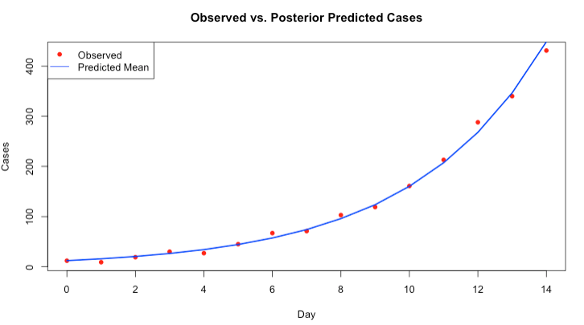

# Introduction to Bayesian Inference

## Introduction

### Lectures (Length: 1:15:22)
```{r, warnings=FALSE, message=FALSE, echo=FALSE}
library(vembedr)
embed_youtube('E0v_2wlMEDM', height=400) %>% use_align('center')
```
[[**Watch on YouTube**]](https://youtu.be/E0v_2wlMEDM)

### Learning outcomes

Today’s session aims to introduce you to the basic Stan programming etiquette for Bayesian analysis in RStudio using Stan as an Interface, and producing output and interpreting it's results. By the end of this session, you should be able to perform the following:

1. Getting acquainted with Stan and learning the basic programming etiquette of Stan - this will include simulating and estimation of parameters.
2. Writing you process model and prior distribution for the parameters.
3. Know how to compile the results into RStudio for use, interpretation and visualisation.

After the demonstration session is delivered in the first 1-hour of the practical - you can use the computer practical session to try the tutorials yourself by following the instructions as well as trying out the tasks. 

### Demonstration (Length: 1:22:54)
```{r, warnings=FALSE, message=FALSE, echo=FALSE}
library(vembedr)
embed_youtube('GPY6AxAFRug', height=400) %>% use_align('center')
```
[[**Watch on YouTube**]](https://youtu.be/GPY6AxAFRug)

### Setting up the work directory 

Go the existing folder **CPD-course** and create a sub folder called "**Day 2**" within the **CPD-course** folder. Here, we will store all our R and Stan scripts. Set the work directory to the **Day 2** folder.

For Windows, the code for setting the work directory will be:

```{r, eval = FALSE}
setwd("C:/Users/AccountName/Desktop/CPD-course/Day 2")
```

For MAC, the code for setting the work directory will be:

```{r, eval = FALSE}
setwd("/Users/AccountName/Desktop/CPD-course/Day 2")
```

### Loading packages

We will need to load the `rstan` package and perform the set-up for Stan by setting the number of cores accordingly.

```{r, eval = FALSE}
# Load the packages with library()
library('rstan')

# set up
options(mc.cores = parallel::detectCores())
rstan_options(auto_write = TRUE)

```

Remember, this tells RStudio to use multiple core for parallel processing whenever Stan is being implemented. Every time you want to use Stan - make sure to load `parallel::detectCores()` and `rstan_options` code.

## Input: Data, Process Model and Assumptions for Priors

This section describes how to code up a basic Stan model from scratch. Here, we will use an example of a mechanistic model for predicting incident disease outcome. This section forms the foundation for later, and more complex models. 

<div class="note">
**PROBLEM:** Bayesian estimation of Epidemic Growth for Aedes-borne Infections

-During the early days of heavy rainfall - there is a huge influx of mosquito populations in Recife which causes an outbreak Dengue virus. Public health officials collected daily case counts over the course of 15 days during this period where rainfalls are pronounced.

The process model for predicting dengue is: $D(t) = D_0 \exp(rt)$

- What is the initial value of dengue cases $D_0$ as an incidence? Note that $D(t)$ is the observed number of cases at time ($t$)
- What is the estimated epidemic growth rate $r$?

</div>

Enter the following dataset:

```{r, eval = FALSE}
# Simulated data
day <- 0:14
observed_cases <- c(12, 9, 19, 30, 27, 45, 67, 71, 103, 119, 161, 213, 288, 340, 431)
```

Let us extract the bits and pieces of information for the **data** block:

- Total sample size is `15` which corresponds to the number of time points starting from 0 to 14. We will define that as `N` in the Stan as an integer `int` with non-zero values in the **data block**
- We are going to read each day point separately from 0 to 14. We will define that as `t` in the Stan as an `array` of size `N` to hold the collection of values. These are non-zero values in the **data block**
- The array for `observed_cases` needs to be extracted. We will define that as an `array` of size `N` containing `int` values. We will name the variable as `y` in Stan within the **data block**

Now that we have the information, in RStudio, we will need to build this dataset into a list object using `list()` to connect it with the **data block** in the Stan script. Let us store the data in list object called `stan_dataset`:

```{r, eval = FALSE}
# create a list object using the list() function
# Data list for Stan
stan_dataset <- list(N = length(day), t = as.vector(day), y = as.integer(observed_cases)
)

# print data in console
stan_dataset
```

Now that the list object is prepared, we can start scripting in Stan.

**FIRST:** We specify the total number of samples as `N` that its an integer `int` which cannot be negative a number `<lower = 0>` in the **data block**. Also, we also need to specify name of the `t` and `y` variables in stan that its an `array` of size `N` consisting of positive `int` numbers in the **data block** too.

```{r, eval=FALSE, highlight=FALSE}
data {
	int<lower = 0> N;
	array[N] int<lower = 0> t;
	array[N] int<lower = 0> y;
}

```

**SECOND:** For the **parameters block**, here we will need to specify the name of the parameters that we want to infer. Here, its $D_0$ which is the **mean** initial (or baseline) cases of Dengue, as well as $r$ which is the **mean** growth rate for the epidemic. Note that, we need to tell Stan that these parameters `real` numbers, where the former is strictly positive values (i.e., use `<lower = 0>` to apply constraint), and $r$ can be either negative or positive.

```{r, eval=FALSE, highlight=FALSE}
data {
	int<lower = 0> N;
	array[N] int<lower = 0> t;
	array[N] int<lower = 0> y;
}

parameters {
	real<lower = 0> D0;
	real r;
}

```

**THIRD:** For the **model block**, we need to create mechanistic model for the $D(t)$. Howeever, we are going to state some priors as follows:

<div class="note">
**Prior assumptions:**

- $D_0$ could be anything, but it is mostly likely 10, and probably between 1 to 20, anything higher is less likely. This corresponds to a gamma distribution i.e., $D_0$ ~ gamma(2, 0.1), which is a **weakly informative prior**
- $r$ could be anything, it is hard to say – therefore I will be cautious and assume that it is negligible (0); however, the growth rate could be an increasing, or a decreasing value, and so I will assume a SD of 1. This corresponds to a normal distribution i.e., $r$ ~ normal(0, 1), hence, its **Non-informative prior**

**Likelihood function for process model**
- The best suited likelihood function for the process model is a **Poisson**. Why? Because the observed data i.e., `observed_cases` is **discrete** and **not continuous**.

</div>

Here is what the Stan code will look like:

```{r, eval=FALSE, highlight=FALSE}

data {
	int<lower = 0> N;
	array[N] int<lower = 0> t;
	array[N] int<lower = 0> y;
}

parameters {
	real<lower = 0> D0;
	real r;
}

model {
	// priors
	D0 ~ gamma(2, 0.1);
	r ~ normal(0, 1);
	
	for (n in 1:N) {
		real lambda = D0 * exp(r * t[n]);
		y[n] ~ poisson(lambda);
	}
}

```

Lastly, we will add one more block called the **generated quantities block** to make predictions about the incidence by generating simulated data that resembles the original.

```{r, eval=FALSE, highlight=FALSE}

data {
	int<lower = 0> N;
	array[N] int<lower = 0> t;
	array[N] int<lower = 0> y;
}

parameters {
	real<lower = 0> D0;
	real r;
}

model {
	D0 ~ gamma(2, 0.1);
	r ~ normal(0, 1);
	
	for (n in 1:N) {
		real lambda = D0 * exp(r * t[n]);
		y[n] ~ poisson(lambda);
	}
}

generated quantities {
  vector[N] y_pred;
  for (n in 1:N) {
    y_pred[n] = poisson_rng(D0 * exp(r * t[n]));
  }
}

```

<div class="note">
**COMPLIMENTS:** Well done, we have built our second Bayesian model in Stan. Let us now save this script. What we need to do next is compile this script in RStudio to get our results.
</div>

## Compiling Stan code in RStudio

You can use the `stan()` function to call the stan script from RStudio in order to obtain the posterior estimates. The results will be stored in `stan` object called `bti_prediction`:

```{r, eval = FALSE}
fit <- stan(
	file = "Incidence_rates.stan",
	data = stan_dataset,
	iter = 3000,
	chains = 3,
	verbose = FALSE
)
```

Recall that the above code's arguments are as follows:

- `data=` specify the dataset stored as a list object.
- `iter=` we are asking the `stan()` to perform 3,000 iterations on each chain to generate the posterior samples. The algorithm behind these iterations can be **MCMC**, **NUTS** or **HMC** algorithm (**NUTS** No-U-turn sampler is the default)
- `chains=` we are asking the `stan()` function to perform 3 chains using 3 cores in our computer

The resulting output can be printed with the function `print()`. Here, we are going to print the mean, standard error in mean, SD and the IQR ranges with 95% limits (i.e., 2.5% and 97.5%):

```{r, eval=FALSE}
print(fit, pars = c("D0", "r"), probs = c(0.025, 0.5, 0.975))

```

We obtain this summary table:

```{r, eval=FALSE, highlight=FALSE}
Inference for Stan model: anon_model.
3 chains, each with iter=3000; warmup=1500; thin=1; 
post-warmup draws per chain=1500, total post-warmup draws=4500.

    mean se_mean   sd  2.5%   50% 97.5% n_eff Rhat
D0 12.31    0.04 1.06 10.31 12.26 14.51   771    1
r   0.26    0.00 0.01  0.24  0.26  0.27   784    1

Samples were drawn using NUTS(diag_e) at Tue Jun 10 08:37:14 2025.
For each parameter, n_eff is a crude measure of effective sample size,
and Rhat is the potential scale reduction factor on split chains (at 
convergence, Rhat=1).

```

<div class="note">
**What does it all mean?** The top part states that 3 chains were run for 3000 iterations. However, the first 1500 samples generated from each chain were discarded as warm-up, meaning that only 1500 samples from each chain were kept, resulting 4500 (1500x3) total post-warm-up sample draws. The output shows the summary statistics for our $\mu$ and $\sigma$. The `lp__` is the log-probability - which is used to quantify how well the model is for the data but, in my opinion, its not a useful estimate. Instead, use the effective sample size `n_eff` and `Rhat`. If the `Rhat` is less than **1.05** for all parameters - it means that the estimation of our parameters are fine. Anything above **1.05** it means that the results are not reliable.  
</div>

<div class="note">
**Interpretation:** The estimated growth rate for incident Dengue **0.26 (95% CrI: 0.24 to 0.27)**. The estimated mean value for $D_0$ was **12.31 (95% CrI: 10.31 to 14.51)** 
</div>

At this point, let us extract the posterior samples for the mean and standard deviation, and graph them to understand it posterior distribution. We can also see if the predictions are similar to original data.

```{r, eval=FALSE}
# extracting the samples (it should be 4500)
# Extract and plot posterior predictions
posterior <- extract(fit)
y_pred_mean <- apply(posterior$y_pred, 2, mean)

```

Here is the plot:

```{r, eval=FALSE}
# plot observed vs predictions
plot(day, observed_cases, pch = 16, col = "red", xlab = "Day", ylab = "Cases",
	main = "Observed vs. Posterior Predicted Cases")

# add cosmetics to plot
lines(day, y_pred_mean, col = "blue", lwd = 2)
legend("topleft", legend = c("Observed", "Predicted Mean"), col = c("red", "blue"), pch = c(16, NA), lty = c(NA, 1))

```

```{r echo=FALSE, out.width = "100%", fig.align='center', cache=TRUE}
 
```

You may be interested in seeing the simulated samples that was drawn from the joint distribution. You can pull this information and store as a data frame:

```{r, eval=FALSE, highlight=FALSE}
posterior_df <- data.frame(
	D0 = posterior$D0,
	r = posterior$r,
	predictions = posterior$y_pred
)

```

## Tasks

### Task 1 - Aedes-borne infestation in Recife 05/2023

**Try this second problem in Stan**: Suppose a random sample of **976 households** from Recife, Brazil, were surveyed Aedes-borne infestation. From the total, **428 were affected by mosquito infestation**. It is common knowledge that **prevalence** of infestation is rough about **20-25%**. Use a Bayesian model to estimate the true prevalence of infestation in Recife. 

**Hints:**

1. In the R script, create a `list()` with `N` and `Infested`. 
2. In the Stan script for the following:
   - Define the `data` block in accordance with the list object. 
   - Use a `parameters` block to define `prevalence` as a parameter (constrain `prevalence` between 0 and 1).
   - Use a `model` block to write the likelihood: `Infested ~ binomial(N, prevalence);`
   - In the `model` block, use it to specify the appropriate **prior** distribution for the `prevalence` parameter.
3. Report the posterior mean of the prevalence of infestation in Recife with its associated 95% credibility interval from the model output. Generate its posterior density plot.