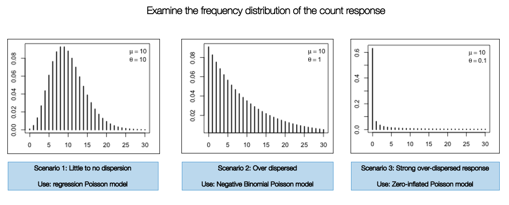
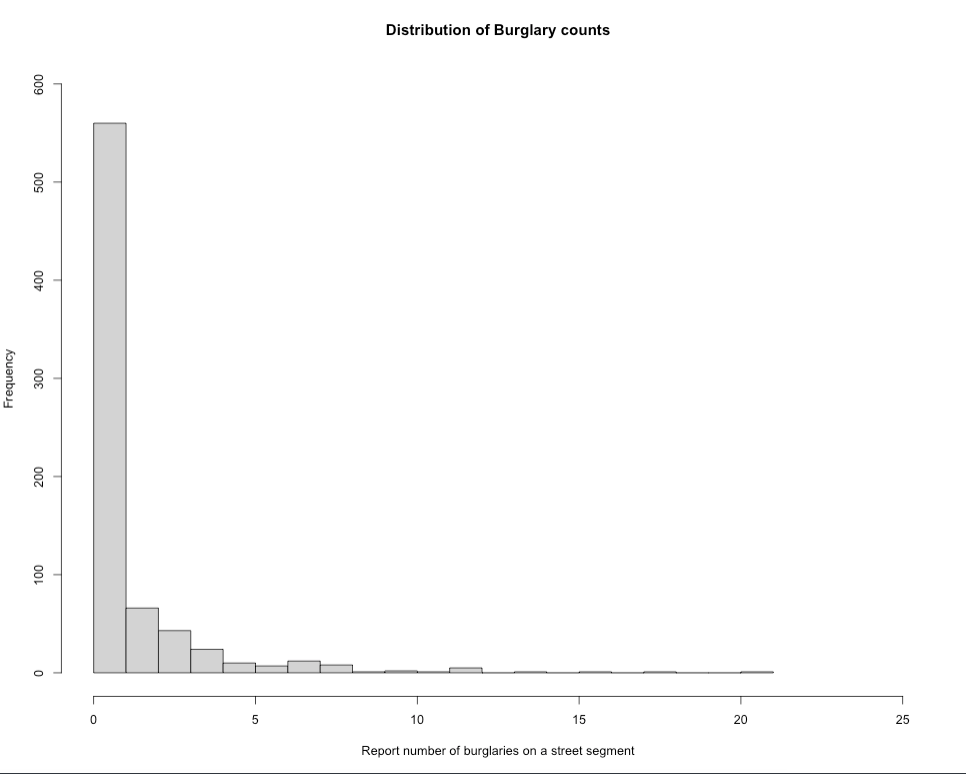

# Bayesian Generalised Linear Models (GLMs)

## Introduction

### Lectures (Length: 1:04:16)
```{r, warnings=FALSE, message=FALSE, echo=FALSE}
library(vembedr)
embed_youtube('1_JbtNNB6_0', height=400) %>% use_align('center')
```
[[**Watch on YouTube**]](https://youtu.be/1_JbtNNB6_0)

### Learning outcomes

Today’s session aims to formally introduce you to **Stan** programming for **Bayesian regression models**. By the end of this session, you should be able to perform the following:

- Select the appropriate **likelihood function** specification for the **Bayesian** regression model i.e., **normal**, **binomial** or **Poisson** to model either **continuous**, **binary**, or **count** outcomes respectively;
- How to fully develop **Stan** code for such regression models with the appropriate **prior (i.e., uninformative, weak or informative) specification** for various parameters; 
- How to interpret the various types of coefficients including **Odds Ratios (OR)** and **Risk Ratios (RR)**;
- Computing **exceedance probabilities**;
- Model validation

You can follow the live walkthrough demonstration, and then use the practical sessions to try the practical tutorials yourself by following the instructions and trying out the tasks.

### Demonstration [Part I] (Length: 1:59:36)
```{r, warnings=FALSE, message=FALSE, echo=FALSE}
library(vembedr)
embed_youtube('WRIFeQ_pgfk', height=400) %>% use_align('center')
```
[[**Watch on YouTube**]](https://youtu.be/WRIFeQ_pgfk)

### Demonstration [Part II] (Length: 1:13:38)
```{r, warnings=FALSE, message=FALSE, echo=FALSE}
library(vembedr)
embed_youtube('Xd1o12psU78', height=400) %>% use_align('center')
```
[[**Watch on YouTube**]](https://youtu.be/Xd1o12psU78)

### Datasets & setting up the work directory 

Go to your folder **CPD-course** and create a sub folder called "**Day 3**". Here, we will store all our R & Stan scripts as well as the dataset for this session. Set your work directory to **Day 3's** folder.

For Windows, the code for setting the work directory will be:

```{r, eval = FALSE}
setwd("C:/Users/AccountName/Desktop/CPD-course/Day 3")
```

For MAC, the code for setting the work directory will be:

```{r, eval = FALSE}
setwd("/Users/AccountName/Desktop/CPD-course/Day 3")
```

The dataset for this practical:

- `Street Burglary Data in Nigeria.csv`

The datasets for the task at the end of the practical:

- `London LSOA 2015 data.csv`
- `Obesity and Fastfoods in MSOAs data.csv`

Let us start with the crime data titled: `Street Burglary Data in Nigeria.csv`

<div class="note">
**Context about the dataset:** Conventional analyses of crime, based on European research models, are often poorly suited to assessing the specific dimensions of criminality in Africa or elsewhere in the Global South. The data used in today's practical is an anonymised resampled excerpt from the [**Development Frontiers in Crime, Livelihoods and Urban Poverty in Nigeria (FCLP)**](https://www.urbantransformations.ox.ac.uk/project/development-frontiers-in-crime-livelihoods-and-urban-poverty-in-nigeria-fclp/) project that aimed to provide an alternative framework for understanding the specific drivers of criminality in a West African urban context. This research project used a mixed-methods approach for combining statistical modeling, geovisualisation and ethnography, and attempted to situate insecurity and crime against a broader backdrop of rapid urban growth, seasonal migration, youth unemployment and informality. The study typically provided researchers both in Nigeria and internationally a richer and more nuanced evidence base on the particular dynamics of crime from an African perspective resulting a number of publications: [**[1]**](https://www.sciencedirect.com/science/article/abs/pii/S0143622818311949), [**[2]**](https://link.springer.com/article/10.1007/s10940-019-09448-3) and [**[3]**](https://academic.oup.com/edited-volume/34642/chapter-abstract/295177150?redirectedFrom=fulltext&login=false).

We will reproduce some of the analysis using a Bayesian regression model.
</div>

### Loading and installing packages

We will need to load the following packages:

```{r, eval = FALSE}
# Load the packages with library()
library('rstan')
library("loo")
library("MASS")
```

For the best experience with `rstan`, we highly recommend using this code to set the cores:

```{r, eval=FALSE}
options(mc.cores = parallel::detectCores())
rstan_options(auto_write = TRUE)
```

## Poisson Regression Modelling

We are going to fit a Poisson-type model on an outcome that contains discrete counts of households reporting to have been victims of burglary. These are counts of burglary events aggregated to street segments. Let us load the data into RStudio and call the object `burglaryDataset`.

```{r, eval=FALSE}
# Set your own directory using setwd() function
# Load data into RStudio using read.csv(). The spreadsheet is stored in the object called 'burglaryData'
burglaryDataset <- read.csv("Street Burglary Data in Nigeria.csv")
names(burglaryDataset)
```

### Selecting the appropriate Poisson model

There are three different types of Poisson models:

- Standard Poisson regression
- Negative Binomial Poisson regression
- Zero-Inflated Poisson regression

The implementation of one of these models are highly dependent on how the frequency distribution of the count response variable are displayed. If it resembles a normal curve - then use the standard Poisson version. Otherwise, use the **Negative Binomial Poisson regression** if there is any evidence of over-dispersion. When there's an inflation of zero counts in the dataset, you will have to use the **Zero-Inflated model** to account for this problem.

```{r echo=FALSE, out.width = "100%", fig.align='center', cache=TRUE,}
 
```

Let's check the frequency distribution of the outcome variable `Burglary` which corresponds to the number of reported instances a property on a street was burgled. You can simply use a histogram to examine its distribution:

```{r, eval=FALSE}
# see lowest count
min(burglaryDataset$burglary)
# see highest count 
max(burglaryDataset$burglary)

# visual distribution
hist(burglaryDataset$burglary, breaks=20, xlim = c(0, 25), ylim = c(0, 600),
    xlab = "Report number of burglaries on a street segment",
    ylab = "Frequency",
    main = "Distribution of Burglary counts")
```

```{r echo=FALSE, out.width = "100%", fig.align='center', cache=TRUE,}
 
```

The plot show evidence of over-dispersion. It indicates that a high number of streets in this city have less frequency of burglaries, while a few number of streets have reported excess number of burglaries. Here, we consider using a **Negative Binomial Poisson regression model** over the standard and zero-inflated versions (i.e., scenario 1 and 3). 

Now, that we know the model type, let us estimate the over-dispersion parameter using the `glm.nb()` function.

```{r, eval=FALSE}
# Fit negative binomial regression null model
nb_model <- glm.nb(burglary ~ 1, data = burglaryDataset)
# Extract theta
theta <- nb_model$theta

theta
[1] 0.3161472
```

The estimated over-dispersion parameter is **0.3161472**, which is small, this suggests that residential burglaries exhibits substantial over-dispersion. We will use this value in our Bayesian model when we code it in Stan.

<div class="note">
**Acknowledgements:** Thanks to **Fernando Rodriguez** for pointing out that it is improper practice to fix the dispersion parameter in the model, and for advising that it is best practice to allow the model to estimate it instead. That part has been amended accordingly. Further thanks to **Jacob Cohen** for noting that the current approach to estimating the dispersion parameter should serve primarily as guidance only to help us understand the extent of dispersion in our data and inform the choice of a prior distribution accordingly.
</div>

### Data preparation and set-up for Bayesian analysis in Stan

Let begin with a model that only contains independent variables that are continuous measures i.e., distance and connectivity. We can prepare the dataset into `list()` object:

```{r, eval=FALSE}
stan_dataset_model1 <- list(N = nrow(burglaryDataset),
	burg = burglaryDataset$burglary, 
	dist = burglaryDataset$distance,
	conn = burglaryDataset$connectivity,
	offset = log(burglaryDataset$totalhouses)
	)
```

<div class="note">
**Important Notes:** The list object `stan_dataset_model1` from RStudio is passed into the Stan.

- `N = nrow(burglaryDataset)` we are extracting the number of observations present in the dataset. Note that this a smart way instead of hard coding the number. Note that here, `N` is `743`, meaning there 743 street segments.
- `burg = burglaryDataset$burglary`: Here, we defined the outcome variable (i.e., counts of burglaries) as `burg`.
- `dist = burglaryDataset$distance`: Independent variable for distance.
- `conn = burglaryDataset$connectivity`: Independent variable for connectivity.
- `off_set = log(burglaryDataset$totalhouses)`: Here, the `off_set` is calculated from taking the log-transform of the `totalhouses`, which is the denominators used for expressing the residential burglaries as a crime rate per capita.
</div>

Let's create our **Stan script** for running a **Negative Binomial Poisson regression** within a Bayesian framework.

### Creating a script to run a Negative Binomial Poisson regression in Stan

A typical **Stan** program for a regression consist of the following 5 **blocks**:

1. Data
2. Parameters
3. Model
4. Generated quantities

The `Data`, `Parameters` and `Model` block **must** be specified for the regression to work. But there will be additional block that we will need to transform the resultant parameters (i.e., coefficients) into relative risk (RR) inside the `Generated quantities` block. 

Let's start with the `data` block:

**FIRST STEP:** We specify the total number of observations `N` as an `integer`, as well as the information we defined in our list object `stan_dataset_model1` to be passed to Stan. This information is specified in the `data` block:

```{r, eval=FALSE, highlight=FALSE}

data {
	int<lower=0> N;                    // declare the overall number of data points to be passed into model
	array[N] int<lower=0> burg;        // define as an array and specify it as an integer for counts
	vector[N] dist;                    // continuous variable
	vector[N] conn;                    // continuous variable
	vector[N] off_set;                 // offset variable for the denominators (total households on a stree segment)
}

```

**SECOND STEP:** For the `parameters` block, here we will need to specify the name of the regression intercept `alpha`, which is baseline risk of residential burglaries, and the two coefficients i.e., `beta[1]` and `beta[2]` for our two independent variables `dist` and `conn` respectively. We will also create `phi`, a dispersion parameter, to mimic the behaviour of that shown in the histogram of Scenario 2 and the derived estimate of **$\theta$ = 0.3161472** ([see section 4.2.1]())

```{r, eval=FALSE, highlight=FALSE}

data {
	int<lower=0> N;                    // declare the overall number of data points to be passed into model
	array[N] int<lower=0> burg;        // define as an array and specify it as an integer for counts
	vector[N] dist;                    // continuous variable
	vector[N] conn;                    // continuous variable
	vector[N] off_set;                 // offset variable for the denominators (total households on a stree segment)
}

parameters {
	real alpha;
	real<lower=0> phi;
	vector[2] beta;
}

```

**THIRD STEP:** We build our likelihood function and specify the priors for each parameter under the `model` block. For all parameters - the priors have been centred around 0, meaning that broadly, these variables have no effect on residential burglaries, and if any, these effects may range from ±1SD (so in risk terms 0.36 to 2.71). The regression model is `neg_binomial_2_log(formula, Overdispersion)`:

```{r, eval=FALSE, highlight=FALSE}

data {
	int<lower=0> N;                    // declare the overall number of data points to be passed into model
	array[N] int<lower=0> burg;        // define as an array and specify it as an integer for counts
	vector[N] dist;                    // continuous variable
	vector[N] conn;                    // continuous variable
	vector[N] off_set;                 // offset variable for the denominators (total households on a stree segment)
}

parameters {
	real alpha;
	real<lower=0> phi;
	vector[2] beta;
}

model {
	// prior specification for our parameters
	alpha ~ normal(0, 1);               
	beta[1] ~ normal(0, 1);
	beta[2] ~ normal(0, 1);
	phi ~ beta(2, 5)
	
	// likelihood function i.e., statistical model
	for (i in 1:N) {
		burg[i] ~ neg_binomial_2_log(alpha + beta[1]*dist[i] + beta[2]*conn[i] + offset[i], phi);
	}
}

```

**LAST STEP:** We instruct Stan to `generated quantitites` to calculate the **relative risk ratio (RRs)** by converting the estimated coefficients by using `exp()`. We ask it to calculate the log likelihood for model validation:

```{r, eval=FALSE, highlight=FALSE}

data {
	int<lower=0> N;                    // declare the overall number of data points to be passed into model
	array[N] int<lower=0> burg;        // define as an array and specify it as an integer for counts
	vector[N] dist;                    // continuous variable
	vector[N] conn;                    // continuous variable
	vector[N] off_set;                 // offset variable for the denominators (total households on a stree segment)
}

parameters {
	real alpha;
	real<lower=0> phi;
	vector[2] beta;
}

model {
	// prior specification for our parameters
	alpha ~ normal(0, 1);               
	beta[1] ~ normal(0, 1);
	beta[2] ~ normal(0, 1);
	phi ~ beta(2, 5)
	
	// likelihood function i.e., statistical model
	for (i in 1:N) {
		burg[i] ~ neg_binomial_2_log(alpha + beta[1]*dist[i] + beta[2]*conn[i] + off_set[i], phi);
	}
}

generated quantities {
	// report crime risk ratios
	real baselineCrimeRR;
	vector[2] CrimeRR;
	baselineCrimeRR = exp(alpha);
	CrimeRR = exp(beta);
	
	// model validation and comparison
	vector[N] log_lik;                 
	for (i in 1:N) {
		log_lik[i] = neg_binomial_2_log_lpmf(burg[i] | alpha + beta[1]*dist[i] + beta[2]*conn[i] + off_set[i], phi);
	}
}

```

Save the stan script as `Cont_Model_1.stan`.

### Compiling our Stan code in RStudio and Results

Now, let us turn our attention to RStudio. Using the `stan()` to compile and obtain the posterior estimation of the overall risk and crime risk ratios (CRR) for the each independent variable:

```{r, eval = FALSE}
# the directory needs to be set to where you saved the dataset and Stan script
crr.negbin.model1 = stan("Cont_Model_1.stan", data=stan_dataset_model1, iter=3000, chains=6, verbose = FALSE)
```

We can print the results accordingly:

```{r, eval = FALSE}
# reports all results
print(crr.negbin.model1, pars = c("alpha", "beta", "baselineCrimeRR", "CrimeRR"), probs = c(0.025, 0.975))
```

**Output summary table**
```{r, eval=FALSE, highlight=FALSE}

Inference for Stan model: anon_model.
6 chains, each with iter=3000; warmup=1500; thin=1; 
post-warmup draws per chain=1500, total post-warmup draws=9000.

                 mean se_mean   sd  2.5% 97.5% n_eff Rhat
alpha           -2.16       0 0.13 -2.42 -1.91  3282    1
beta[1]          0.00       0 0.00  0.00  0.00  4237    1
beta[2]          0.06       0 0.02  0.02  0.11  3216    1
baselineCrimeRR  0.12       0 0.02  0.09  0.15  3225    1
CrimeRR[1]       1.00       0 0.00  1.00  1.00  4236    1
CrimeRR[2]       1.07       0 0.02  1.02  1.11  3215    1

Samples were drawn using NUTS(diag_e) at Fri Jan 24 02:30:42 2025.
For each parameter, n_eff is a crude measure of effective sample size,
and Rhat is the potential scale reduction factor on split chains (at 
convergence, Rhat=1).

```

Here is the messing part - **interpretation**. Before anything, note that `alpha`, `beta[1]` and `beta[2]` corresponds to the intercept, and coefficients for distance and connectivity, respectively. These are on the log-scale! 

The risk ratios from `alpha`, `beta[1]` and `beta[2]` which, in turn, corresponds to the intercept, and coefficients for distance and connectivity, respectively, are the `baselineCrimeRR`, `CrimeRR[1]` and `CrimeRR[2]`. For instance, the significant result is for connectivity, which shows for every unit increase in the number to street connections on a segment in the network, the risk of residential burglaries increase by 1.07 (7%), which is significant based on its 95% Credibility Interval (95 CrI: 1.02-1.11).

We can compute exceedance probabilities i.e., that such risk concerning connectivity are greater than 1 (meaning there's an excess risk):

```{r, eval=FALSE}
# Here, we can extract the simulated sample for CrimeRR[2]
conn_draws <- extract(crr.negbin.model1, 'CrimeRR[2]')[[1]]

mean(conn_draws > 1.00)
[1] 0.9977778
```

This indicates a strong chance (99.7%) that streets with more connections to other street segments in the network will certainly increase the risk of residential burglaries.

Lastly, we will assess the validity of our model using a test called **Leave-One-Out Cross-Validation**. The estimate from this test **Expected Log Predictive Density (ELPD)** quantifies how well a model performs and so higher values of **ELPD** indicates better predictive performance. While, it can be interpreted on its own, its primary value lies in model comparison rather than as an absolute measure.

```{r, eval=FALSE}
# extracting ELPD leave-one-out results from model with continuous variables only
log_lik_with_cont <- extract_log_lik(crr.negbin.model1, merge_chains = FALSE)
r_eff_with_cont <- relative_eff(log_lik_with_cont)
loo_cont <- loo(log_lik_with_cont, r_eff_with_cont, cores = 6)
```

```{r, eval=FALSE}
print(loo_cont)

Computed from 9000 by 743 log-likelihood matrix.

         Estimate   SE
elpd_loo  -1022.1 37.7
p_loo         2.6  0.4
looic      2044.3 75.3
------
MCSE of elpd_loo is 0.0.
MCSE and ESS estimates assume independent draws (r_eff=1).

All Pareto k estimates are good (k < 0.7).
See help('pareto-k-diagnostic') for details.
```

We take note that the ELPD is `-1022.1`

### Model with categorical variables

The purpose of this section is to show:

- How to include categorical variables into the model
- Perform model comparisons

Let's include the following categorical variables: `integq` and `choiceq` into the regression. Each variable has four categories, we want to omit the first category as it represents the lowest exposure group, and use it a reference for the higher categories when we estimate their risk.

```{r, eval=FALSE}

# See table for categorical variables
table(burglaryDataset$choiceq)
table(burglaryDataset$integq)

# Create dummy variables for choice
burglaryDataset$choicecat2 <- ifelse(burglaryDataset$choiceq == 2, 1, 0)
burglaryDataset$choicecat3 <- ifelse(burglaryDataset$choiceq == 3, 1, 0)
burglaryDataset$choicecat4 <- ifelse(burglaryDataset$choiceq == 4, 1, 0)

# Create dummy variables for integration
burglaryDataset$integ2 <- ifelse(burglaryDataset$integq == 2, 1, 0)
burglaryDataset$integ3 <- ifelse(burglaryDataset$integq == 3, 1, 0)
burglaryDataset$integ4 <- ifelse(burglaryDataset$integq == 4, 1, 0)
```

Let us expand the model to include independent variables that are both continuous and categorical measures i.e., distance and connectivity, choice and integration, and the new information into a `list()` object:

```{r, eval=FALSE}
stan_dataset_model2 <- list(N = nrow(burglaryDataset),
	burg = burglaryDataset$burglary, 
	dist = burglaryDataset$distance,
	conn = burglaryDataset$connectivity,
	chcat2 = burglaryDataset$choicecat2,
	chcat3 = burglaryDataset$choicecat3,
	chcat4 = burglaryDataset$choicecat4,
	intcat2 = burglaryDataset$integ2,
	intcat3 = burglaryDataset$integ3,
	intcat4 = burglaryDataset$integ4,
	off_set = log(burglaryDataset$totalhouses)
	)
```

The amended Stan code will look something as follows:

```{r, eval=FALSE, highlight=FALSE}

data {
	int<lower=0> N;                    // declare the overall number of data points to be passed into model
	array[N] int<lower=0> burg;        // define as an array and specify it as an integer for counts
	vector[N] dist;                    // continuous variable
	vector[N] conn;                    // continuous variable
	vector[N] chcat2;
	vector[N] chcat3;
	vector[N] chcat4;
	vector[N] intcat2;
	vector[N] intcat3;
	vector[N] intcat4;
	vector[N] off_set;                 // offset variable for the denominators (total households on a stree segment)
}

parameters {
	real alpha;
	real<lower=0> phi;
	vector[2] beta;
	vector[3] chcq;
	vector[3] intq;
}

model {
	// prior specification for our parameters
	alpha ~ normal(0, 1);               
	beta ~ normal(0, 1);
	chcq  ~ normal(0, 1);
	intq  ~ normal(0, 1);
	phi ~ beta(2, 5)
	
	// likelihood function i.e., statistical model
	for (i in 1:N) {
		burg[i] ~ neg_binomial_2_log(alpha + beta[1]*dist[i] + beta[2]*conn[i] + chcq[1]*chcat2[i] + chcq[2]*chcat3[i] + chcq[3]*chcat4[i] + intq[1]*intcat2[i] + intq[2]*intcat3[i] + intq[3]*intcat4[i] + off_set[i], phi);
	}
}

generated quantities {
	// report crime risk ratios
	real baselineCrimeRR;
	vector[2] betaRR;
	vector[3] chcqRR;
	vector[3] intqRR;
	baselineCrimeRR = exp(alpha);
	betaRR = exp(beta);
	chcqRR = exp(chcq);
	intqRR = exp(intq);
	
	// model validation and comparison
	vector[N] log_lik;                 
	for (i in 1:N) {
		log_lik[i] = neg_binomial_2_log_lpmf(burg[i] | alpha + beta[1]*dist[i] + beta[2]*conn[i] + chcq[1]*chcat2[i] + chcq[2]*chcat3[i] + chcq[3]*chcat4[i] + intq[1]*intcat2[i] + intq[2]*intcat3[i] + intq[3]*intcat4[i] + off_set[i], phi);
	}
}

```

Please save the Stan script as `Cat_Model_2.stan`.

We can use the `stan()` to compile the updated code to obtain the posterior estimation accordingly:

```{r, eval = FALSE}
# the directory needs to be set to where you saved the dataset and Stan script
crr.negbin.model2 = stan("Cat_Model_2.stan", data=stan_dataset_model2, iter=3000, chains=6, verbose = FALSE)
```

We can print the results accordingly:

```{r, eval = FALSE}
# reports all results
print(crr.negbin.model2, pars = c("baselineCrimeRR", "betaRR", "chcqRR", "intqRR"), probs = c(0.025, 0.975))
```

**Output summary table**
```{r, eval=FALSE, highlight=FALSE}

Inference for Stan model: anon_model.
6 chains, each with iter=3000; warmup=1500; thin=1; 
post-warmup draws per chain=1500, total post-warmup draws=9000.

                mean se_mean   sd 2.5% 97.5% n_eff Rhat
baselineCrimeRR 0.13       0 0.03 0.09  0.20  4190    1
betaRR[1]       1.00       0 0.00 1.00  1.00 11128    1
betaRR[2]       1.08       0 0.03 1.03  1.14  5524    1
chcqRR[1]       0.95       0 0.21 0.60  1.44  4692    1
chcqRR[2]       0.94       0 0.23 0.57  1.46  4593    1
chcqRR[3]       0.86       0 0.29 0.44  1.55  4266    1
intqRR[1]       0.94       0 0.20 0.61  1.39  5311    1
intqRR[2]       0.84       0 0.18 0.54  1.25  5119    1
intqRR[3]       0.81       0 0.19 0.49  1.24  5302    1

Samples were drawn using NUTS(diag_e) at Fri Jan 24 03:34:39 2025.
For each parameter, n_eff is a crude measure of effective sample size,
and Rhat is the potential scale reduction factor on split chains (at 
convergence, Rhat=1).

```

We can compare this model against the previous one to see which one highest ELPD value for better predictive performance.

```{r, eval=FALSE}
# extracting ELPD leave-one-out results from model with both continuous and categorical variables
log_lik_with_cat <- extract_log_lik(crr.negbin.model2, merge_chains = FALSE)
r_eff_with_cat <- relative_eff(log_lik_with_cat)
loo_cat <- loo(log_lik_with_cat, r_eff_with_cat, cores = 6)
```

```{r, eval=FALSE}
print(loo_cat)

Computed from 9000 by 743 log-likelihood matrix.

         Estimate   SE
elpd_loo  -1026.7 37.7
p_loo         7.7  1.0
looic      2053.4 75.4
------
MCSE of elpd_loo is 0.0.
MCSE and ESS estimates assume independent draws (r_eff=1).

All Pareto k estimates are good (k < 0.7).
See help('pareto-k-diagnostic') for details.
```

This first model's ELPD was `-1022.1`, and full model's show `-1026.7`. Based on this result, it is clear that the first model is better in terms of predictive performance since its **ELPD** is higher (i.e., `-1022.1` vs `-1026.7`). So its best to stick with the first model, unless there is a strong theoretical reason to use second model (i.e., accounting for confounding).

## Tasks

### Task 1 - Obesity and Fastfoods in London 

Accessibility to junk food restaurants in young adolescents especially after school hours is a growing cause for concern. Especially, now that many young adults have a sedentary lifestyle; hence obesity rates among this population is increasing in the UK. 

**Try this problem in Stan**: Use the dataset `Obesity and Fastfoods in MSOAs data.csv` to determine the links between prevalence of obesity in high school students and density of fast food (cheap) restaurant and deprivation in MSOAs in London. Implement a Bayesian GLM using **Stan** code.

**Variable names:**

- `SEQID`: ID number for row
- `MSOA11CD`: Unique identifier for MSOA area
- `MSOA11NM`: Name of the MSOA area
- `OBESE`: Number of child identified as obese in MSOA in London
- `TOTAL`: Total number of children surveyed for BMI measurements
- `IMDMSOA`: Area-level socioeconomic deprivation score (higher scores means higher deprivation and vice versa)
- `RESTCAT`: Categorical variable for classifying an MSOA in terms of density of junk/cheap fast food outlets restaurants: `1 = 1 to 10`, `2= 11 to 25`, `3= 26 to 50` and `4= 51 to 300`. 

**HINT**: You might want to consider using the following functions: `binomial_logit()` or `binomial()` in the **model** block and reporting the **odd ratios** using the **generated quantities** block. You might want to consider computing the exceedance probabilities for the **odd ratios** using the threshold of 1.

### Task 2 - Factors affecting house prices in London (2015)

**Try this problem in Stan**: Use `London LSOA 2015 data.csv` data pertained house prices in 2015, and assess it’s relationship with public transport accessibility (PTA), average income and socioeconomic deprivation (IMD) as the independent variables. Implement a Bayesian GLM using Stan code.

**Variables names:**

- `LSOACODE`:	Unique identification code for the geographic area
- `AVEPRICE`: (Dependent variable)	Average house price estimated for the LSOA in 2015
- `AVEINCOME`: Estimated average annual income for households within an LSOA in 2015
- `IMDSCORE`:	Deprivation score for an LSOA in 2015
- `PTAINDEX`:	Measures levels of access/connectivity to public transport

**HINT**: You might want to consider using the following functions: `normal()` in the **model** block. You might want to consider computing the exceedance probabilities for the **coefficients** using the threshold of 0.