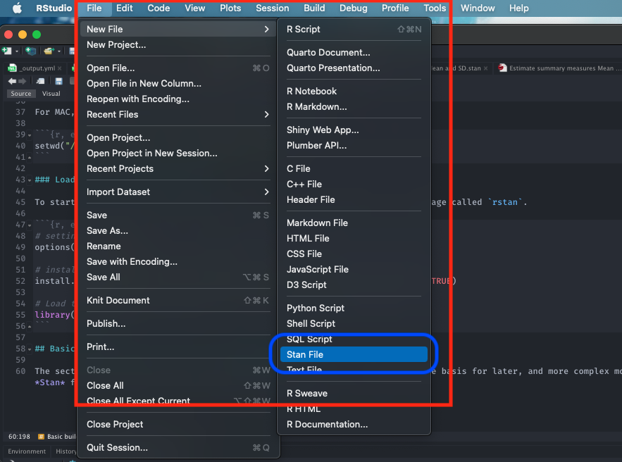
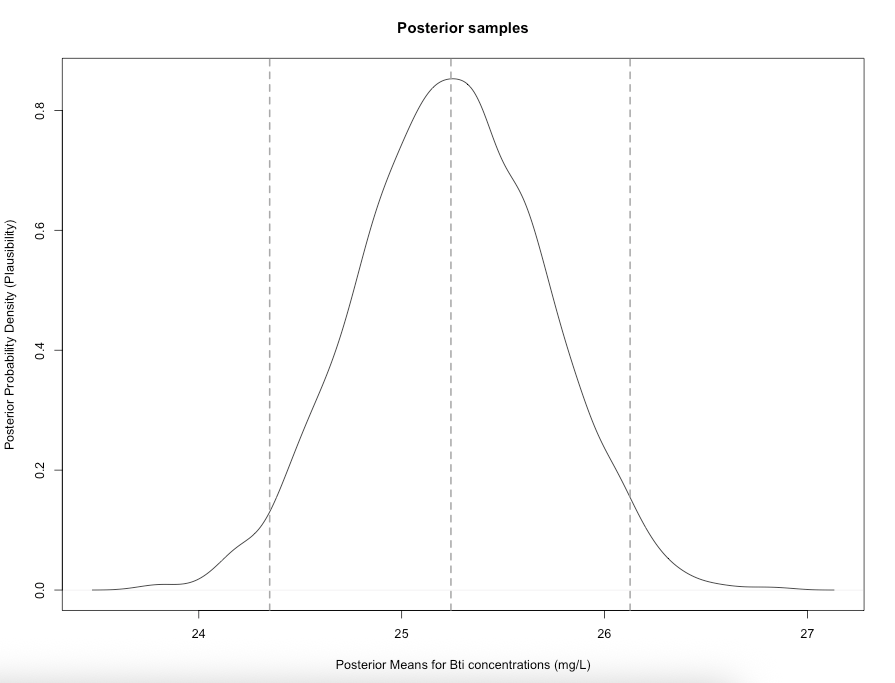
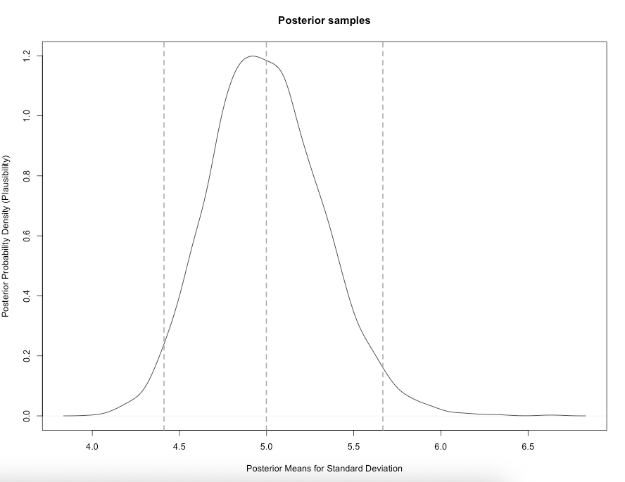

# Introduction to Stan Programming

## Introduction

### Lecture video (TBC)

[Embed recorded lecture video here]

[[**Watch on YouTube**]]()

### Learning outcomes

Today’s session aims to introduce you to the basic Stan programming etiquette for Bayesian analysis in RStudio using Stan as an Interface, and producing output and interpreting it's results. By the end of this session, you should be able to perform the following:

1. Getting acquainted with Stan and learning the basic programming etiquette of Stan - this will include simulating and estimation of parameters.
2. Know how to write and compile various **probability distributions** for simple parameters (i.e., mean, standard deviation, a proportion etc.,) in Stan.
3. Know how to compile the results into RStudio for use, interpretation and visualisation.

After the demonstration session is delivered in the first 1-hour of the practical - you can use the computer practical session to try the tutorials yourself by following the instructions as well as trying out the tasks. 

### Demonstration video (TBC)

[Embed recorded demonstration video here]

[[**Watch on YouTube**]]()

### Setting up the work directory 

Since, this is our first practical lesson for **Day 1**, let us create a new folder **CPD-course** at the desktop location of our computer. Now, create a sub folder called "**Day 1**" within the **CPD-course** folder. Here, we will store all our R and Stan scripts. Set the work directory to the **Day 1** folder. Download the dataset for today and move them into the **Day 1** folder:

- `Bti_Larvicide_dataset.csv`

For Windows, the code for setting the work directory will be:

```{r, eval = FALSE}
setwd("C:/Users/AccountName/Desktop/CPD-course/Day 1")
```

For MAC, the code for setting the work directory will be:

```{r, eval = FALSE}
setwd("/Users/AccountName/Desktop/CPD-course/Day 1")
```

### Loading packages

To start writing scripts for Bayesian analysis, we will need to load the `rstan` package.

```{r, eval = FALSE}
# Load the packages with library()
library('rstan')

```

Note that when you load `rstan` from cran, you will see some recommendations on using multiple cores for speeding the process. For the best experience, we highly recommend using this code:

```{r, eval=FALSE}
options(mc.cores = parallel::detectCores())
rstan_options(auto_write = TRUE)
```

This tells RStudio to use multiple core for parallel processing whenever Stan is being implemented. Every time you want to use Stan - make sure to load `parallel::detectCores()` and `rstan_options` code.

## About Stan Programming

This section describes how to code up a basic Stan model. This section forms the foundation for later, and more complex models. 

### Basic building blocks I: Opening a Stan Script in RStudio

Alright, let's open a **Stan** file. You can do this by clicking and selecting `File` > `New File` > `Stan File` 

```{r echo=FALSE, out.width = "100%", fig.align='center', cache=TRUE,}
 
```

When you open a new **Stan** file, you will be greeted with an `untitled script` which contains the following bits of code:

```{r, eval=FALSE, highlight=FALSE}
//
// This Stan program defines a simple model, with a
// vector of values 'y' modeled as normally distributed
// with mean 'mu' and standard deviation 'sigma'.
//
// Learn more about model development with Stan at:
//
//    http://mc-stan.org/users/interfaces/rstan.html
//    https://github.com/stan-dev/rstan/wiki/RStan-Getting-Started
//

// The input data is a vector 'y' of length 'N'.
data {
  int<lower=0> N;
  vector[N] y;
}

// The parameters accepted by the model. Our model
// accepts two parameters 'mu' and 'sigma'.
parameters {
  real mu;
  real<lower=0> sigma;
}

// The model to be estimated. We model the output
// 'y' to be normally distributed with mean 'mu'
// and standard deviation 'sigma'.
model {
  y ~ normal(mu, sigma);
}

```

Do not worry about that - it is just some formalities put there by default by the developers behind `rstan`. You can delete everything you see in this script as we will build our own basic script from scratch. 

Once you have deleted the default information save the empty file in the **Day 1** folder naming it `Predicting_larvicide_concentrations.stan`. Whenever you are saving Stan programme in RStudio always make sure to save it with a `.stan` ending. 

### Basic building blocks II: Structure of a Stan script

A typical **Stan** script consist of the following 6 **blocks**:

1. Data
2. Transformed data
3. Parameters
4. Transformed parameters
5. Model
6. Generated quantities

Out of these 6 blocks, the `Data`, `Parameters` and `Model` block **must** be specified in your Stan script. These are three compulsory blocks needed in any Stan script in order for a Bayesian model to work within the `rstan` environment. Let us define what these three important blocks are.

**FIRST:** The **data block** allows the user to declare how the model reads the dataset from RStudio by specifying the sample size **N** or observations; the number of **k** parameters that needs to be estimated; the names or list of independent variables for the corresponding parameters (e.g., coefficients); the dependent variable (or outcome); as well as any constraints that needs to be applied to the dataset. 

A **data** block is specified accordingly in the script as:

```{r, eval=FALSE, highlight=FALSE}
data {

}

```

It is within these curly brackets will specify these details of our dataset. They must be precise as it will have to correspond with the dataset that's currently loaded in RStudio's memory.

**SECOND:** The **parameters block** allows the user to declare all the unknown quantities we are going to estimate. The parameters that go here are the ones we want to infer or predict. It define includes the name(s) of the parameters that correspond things like the `mean`, `variance`, `sd`, `coefficients` or anything that you are going to estimate. 

A **parameters** block is specified after the **data** block:

```{r, eval=FALSE, highlight=FALSE}
data {

}

parameters {
	
}

```

**THIRD:** The **model block** allows the user to declare and specify the sampling statistical statements for the **dependent variable** (i.e., likelihood function) as well as any **priors** for the parameters we will estimate through the model. This block is where we code our **probability distributions**.

A **model** block is specified after the **parameters** block:

```{r, eval=FALSE, highlight=FALSE}
data {

}

parameters {
	
}

model {
	
}

```

Note that adding a double forward slashes ``//`` lets the user add a comment to the script. Let us add some comments into each of the blocks:

```{r, eval=FALSE, highlight=FALSE}
// Add comments after double forward slashes 

data {
	// data block

}

parameters {
	// parameters block
	
}

model {
	// model block
	
}

```

<div class="note">
**Important Notes:** Since, the other blocks are not compulsory - we will leave them out for now. But we will come back and explain what those remaining blocks are in **Day 2 and 3**. Now, save your Stan script.
</div>

### Basic building blocks III: Data types and constraint declarations

In Stan, all parameters and data must be defined as variables with a specific type. Note, this is quite a pain but going through this step allows `rstan` to perform really fast. There are four basic **data** types:

1. `int`: for integers, used for specifying the sample size, and is applied to discrete variables
2. `real`: for continuous, is applied to continuous variables (i.e., ratio or interval)
3. `array`: for a containing several elements of data points that are `real` or `int` values
4. `vector`: for a containing several elements of data points that are `real` or `int` values. It is similar to `array` syntax, but if you are going to perform algebraic manipulation of several elements with `matrices` - then it is best to use them as a `vector`.
5. `matrix`: for containing a collection of several column `vectors` as a single `n`-by-`m` object.

For **constraints**, we specify them on variables. For example, if we are dealing with a proportion **p** we will code it as `real<lower=0, upper=1> p` to tell Stan that **p** can be any value from 0 to 1, inclusive. Note that specifying constraints really helps speed Stan up so use them wherever you can.

Lastly, you can create **array** of variables. For example, `array[10] real<lower=0 upper=1> p` tells Stan that **p** is an array of 10 real values for proportions. We can also create a matrix to represent a set of independent variables and so on. 

Please take you time with learning these codes, and experiment with them more to gain proficiency. 

Now that we have discussed these points - let us work with an actual demonstration to show **data types** and **constraints** work.

### Basic building blocks IV: Developing our model

<div class="note">
**PROBLEM:** To combat mosquito populations - water bodies are treated with biological an agent called **Bti dunks**. These are ringed shaped objects that dissolve in standing water where mosquitoes breed. 120 samples from various points to ensure its working against mosquitoes and its not a cause for concern in terms of environmental contamination. 

- What is the mean & standard deviation, and uncertainty surrounding the levels of Bti larvicide concentrations present in standing water?

</div>

If you open the following dataset `Bti_Larvicide_dataset.csv`:

```{r, eval = FALSE}
# open dataset
Bti_data <- read.csv("Bti_Larvicide_dataset.csv")
# open data viewer
View(Bti_data)
```

You will notice that it contains 120 observations, and 2 columns:

- The first column `standing_water_id` is the unique ID number for each observation
- The second column `Bti_mgl` is the concentrations of Bti larvicides in various water bodies (in mg/L)

Let us build our first model that predicts the mean and standard deviation as a posterior distribution. Let us extract the bits and pieces of information for the **data** block:

- Total sample size is `120`. We will define that as `N` in the Stan as an integer `int` with non-zero values in the **data block**
- The column in the data frame for `Bti_data` (i.e., `Bti_mgl`) needs to be extracted. We will define that as an `array` of size `N` containing `real` values. We will name the variable as `bti` in Stan within the **data block**

Now that we have the information, in RStudio, we will need to build this dataset into a list object using `list()` to connect it with the **data block** in the Stan script. Let us store the data in list object called `stan_dataset`:

```{r, eval = FALSE}
# create a list object using the list() function
stan_dataset <- list(N = 120, bti = Bti_data$Bti_mgl)

# print data in console
stan_dataset
```

Now that the list object is prepared, we can start scripting in Stan.

**FIRST:** We specify the total number of samples as `N` that its an integer `int` which cannot be negative a number `<lower = 0>` in the **data block**. Also, we also need to specify name of the `bti` variable in stan that its an `array` of size `N` consisting real numbers in the **data block** too.

```{r, eval=FALSE, highlight=FALSE}
data {
	// define N (120)
	int<lower = 0> N;
	// create an array of size 120 to store BTI values
	array[N] real bti;
}

```

**SECOND:** For the **parameters block**, here we will need to specify the name of the parameters that we want to infer. Here, its $\mu$ which is the **mean** levels of Bti concentrations, as well as $\sigma$ which is the **standard deviation**. Note that, we need to tell Stan that these parameters are `real` numbers, as well as they are strictly positive values (i.e., use `<lower = 0>` to apply constraint) because we cannot have negative concentrations & a negative value for standard deviation.

```{r, eval=FALSE, highlight=FALSE}
data {
	// define N (120)
	int<lower = 0> N;
	// create an array of size 120 to store BTI values
	array[N] real bti;
}

parameters {
	// defined the mean as mu
	real<lower = 0> mu;
	// defined the SD as sigma
	real<lower = 0> sigma;
}

```

**THIRD:** For the **model block**, we need to state that both $\mu$ and $\sigma$ in the likelihood function - hence, **bti** variable will be sampled from the **normal distribution**. The model block will be:

```{r, eval=FALSE, highlight=FALSE}
data {
	// define N (120)
	int<lower = 0> N;
	// create an array of size 120 to store BTI values
	array[N] real bti;
}

parameters {
	// defined the mean as mu
	real<lower = 0> mu;
	// defined the SD as sigma
	real<lower = 0> sigma;
}

model {
	// likelihood function, without any prior distribution specified
	bti ~ normal(mu, sigma);
}

```

<div class="note">
**COMPLIMENTS:** Well done, we have built our first Bayesian model in Stan. Let us now save this script. What we need to do next is compile this script in RStudio to get our results.
</div>

### Basic building blocks V: Compiling Stan code in RStudio

You can use the `stan()` function to call the stan script from RStudio in order to obtain the posterior estimates. The results will be stored in `stan` object called `bti_prediction`:

```{r, eval = FALSE}
# the directory needs to be set to where you save the dataset and Stan script
bti_prediction <- stan("Predicting_larvicide_concentrations.stan", 
	data=stan_dataset, 
	iter=3000, 
	chains=3, 
	verbose = FALSE)
```

Some notes on the above code's arguments:

- `data=` specify the dataset stored as a list object.
- `iter=` we are asking the `stan()` to perform 3,000 iterations on each chain to generate the posterior samples. The algorithm behind these iterations can be **MCMC**, **NUTS** or **HMC** algorithm (**NUTS** No-U-turn sampler is the default)
- `chains=` we are asking the `stan()` function to perform 3 chains using 3 cores in our computer

The resulting output can be printed with the function `print()`. Here, we are going to print the mean, standard error in mean, SD and the IQR ranges with 95% limits (i.e., 2.5% and 97.5%):

```{r, eval=FALSE}
print(bti_prediction, probs=c(0.025, 0.25, 0.5, 0.75, 0.975))

```

We obtain this summary table:

```{r, eval=FALSE, highlight=FALSE}
Inference for Stan model: anon_model.
3 chains, each with iter=3000; warmup=1500; thin=1; 
post-warmup draws per chain=1500, total post-warmup draws=4500.

         mean se_mean   sd    2.5%     25%     50%     75%   97.5% n_eff Rhat
mu      25.27    0.01 0.45   24.39   24.96   25.26   25.57   26.18  3624    1
sigma    5.01    0.01 0.34    4.40    4.77    4.99    5.22    5.72  3811    1
lp__  -247.60    0.02 1.03 -250.35 -247.97 -247.28 -246.87 -246.61  2164    1

Samples were drawn using NUTS(diag_e) at Mon Jun  9 01:10:46 2025.
For each parameter, n_eff is a crude measure of effective sample size,
and Rhat is the potential scale reduction factor on split chains (at 
convergence, Rhat=1).

```

<div class="note">
**What does it all mean?** The top part states that 3 chains were run for 3000 iterations. However, the first 1500 samples generated from each chain were discarded as warm-up, meaning that only 1500 samples from each chain were kept, resulting 4500 (1500x3) total post-warm-up sample draws. The output shows the summary statistics for our $\mu$ and $\sigma$. The `lp__` is the log-probability - which is used to quantify how well the model is for the data but, in my opinion, its not a useful estimate. Instead, use the effective sample size `n_eff` and `Rhat`. If the `Rhat` is less than **1.05** for all parameters - it means that the estimation of our parameters are fine. Anything above **1.05** it means that the results are not reliable.  
</div>

### Basic building blocks VI: Extract posterior samples & interpretation

At this point, let us extract the posterior samples for the mean and standard deviation, and graph them to understand it posterior distribution. We use the `extract()` function from the `rstan` package, and graph them:

```{r, eval=FALSE}
# extracting the samples (it should be 4500)
extracted_samples <- rstan::extract(bti_prediction)

```

The object `extracted_samples` should contain the 4,500 sample results each for the Bti (mg/L) mean and its corresponding SD. From the extraction, suppose if you wanted to compute the posterior mean, with the 0.025 and 0.975 quantiles (these limits are referred to as **95% credibility limits (95% CrI)**). This can be done using both the `mean()` and `quantile()` function. 

Here is how we compute them:

```{r, eval=FALSE, highlight=FALSE}
# posterior mean for mu
mean(extracted_samples$mu)

# calculate 95% Credibility limits (95% CrI) for mu
quantile(extracted_samples$mu, probs = c(0.025, 0.975))
```

We can also examine the posterior samples as a distribution as a visual through a density plot:

```{r, eval = FALSE}
# generate probability density plot of the posterior samples
plot(density(extracted_samples$mu), 
	main = "Posterior samples", 
	xlab = "Posterior Means for Bti concentrations (mg/L)", 
	ylab = "Posterior Probability Density (Plausibility)")

# Add vertical dashed line at the mean
abline(v = 25.24285, lty = "dashed", col = "darkgrey", lwd = 2)
# add vertical line for the lower 95% CrI value
abline(v = 24.34943, lty = "dashed", col = "darkgrey", lwd = 2)
# add vertical line for the upper 95% CrI value
abline(v = 26.12595, lty = "dashed", col = "darkgrey", lwd = 2)
```

```{r echo=FALSE, out.width = "100%", fig.align='center', cache=TRUE}
 
```

We can also report the results for the standard deviation as well (i.e., its posterior mean, 95% CrI and posterior distribution):

```{r, eval=FALSE, highlight=FALSE}
# posterior mean for sigma 
mean(extracted_samples$sigma)

# calculate 95% Credibility limits (95% CrI) for sigma
quantile(extracted_samples$sigma, probs = c(0.025, 0.975))

# generate probability density plot of the posterior samples for sigma
plot(density(extracted_samples$sigma), 
	main = "Posterior samples", 
	xlab = "Posterior Means for Standard Deviation", 
	ylab = "Posterior Probability Density (Plausibility)")

# Add vertical dashed line at the mean
abline(v = 4.998751, lty = "dashed", col = "darkgrey", lwd = 2)
# add vertical line for the lower 95% CrI value
abline(v = 4.411431, lty = "dashed", col = "darkgrey", lwd = 2)
# add vertical line for the upper 95% CrI value
abline(v = 5.666914, lty = "dashed", col = "darkgrey", lwd = 2)
```

```{r echo=FALSE, out.width = "100%", fig.align='center', cache=TRUE}
 
```

<div class="note">
**Interpretation:** The estimated mean ($\mu$) of Bti concentrations from our sample posterior distribution was **25.24 mg/L** (i.e., most likely or plausible value) with 95% credibility limits of **24.39** and **26.12**. Formally writing as $\mu$ = **25.24 mg/L (95% CrI: 24.39-26.12)**. In terms of the spread, the estimated standard deviation ($\sigma$) is **4.99 mg/L (95% CrI: 4.411 to 5.666)** 
</div>

## Tasks

### Task 1 - Simulating and Estimating Body Mass Index (BMI)

**Try this first problem in Stan**: You are tasked to simulate a sample of 1000 BMI values from a Normal distribution with mean 23 and SD 8.3. Then, using Stan, fit a Bayesian model to estimate the unknown population mean BMI and its 95% credible interval. Assume both the population mean ($\mu$) and standard deviation ($\sigma$) are unknown. 

**Hints:**

1. In the R script, use the function `rnorm()` to generate your sample of 1000 BMI points
2. In the R script, create a `list()` with `N` and `bmi` (your simulated data)
3. In the Stan script for the following:
   - Define the `data` block in accordance with the list object.
   - Use a `parameters` block to define `mu` and `sigma` as `real` values (constrain `sigma` to be positive).
   - Use a `model` block to write the likelihood: `bmi ~ normal(mu, sigma);`
4. Report the posterior mean of BMI and its 95% credible interval from the model output. Generate its posterior density plot.

### Task 2 - Low-level arsenic poisoning in Cornwall, UK

**Try this second problem in Stan**: Suppose a random sample of 50 villagers from a rural community in Cornwall, UK, were surveyed for signs of chronic arsenic exposure. Each person was classified as either **Diseased** or Healthy. Out of the 50 surveyed, **19 were found to be diseased**. Use a Bayesian model to estimate the true prevalence of arsenic poisoning in the wider population. 

**Hints:**

1. In the R script, create a `list()` with `N` and `Diseased`. 
2. In the Stan script for the following:
   - Define the `data` block in accordance with the list object. 
   - Use a `parameters` block to define `prevalence` as a parameter (constrain `prevalence` between 0 and 1).
   - Use a `model` block to write the likelihood: `Diseased ~ binomial(N, prevalence);`
3. Report the posterior mean of the prevalence of metallic poisoning in Cornwall with its 95% credible interval from the model output. Generate its posterior density plot.

<div class="note">
**Note:** Solutions for task 1 and 2 will be made available later today
</div>